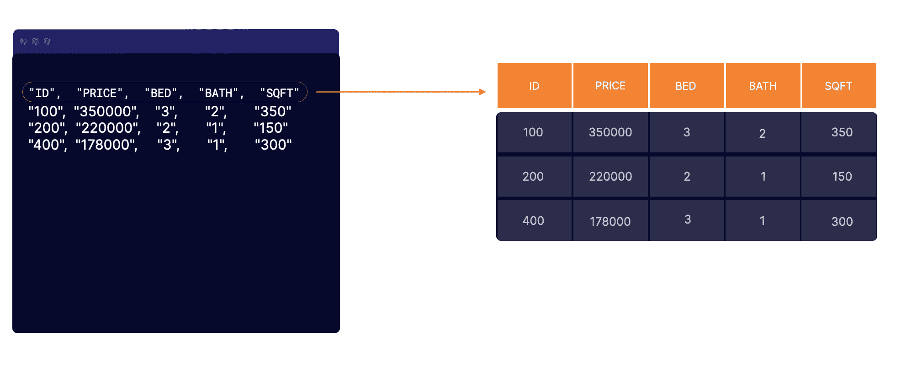

# 亚马逊雅典娜解释说:这是什么，我应该什么时候使用它？|云专家

> 原文：<https://acloudguru.com/blog/engineering/amazon-athena-explained-what-is-it-and-when-should-i-use-it>

所以，你是数据分析师！根据你问的人的不同，这两个词对你如何度过时间有不同的含义。

对你的朋友来说，你是那种神秘的专业人士，整天从事人工智能或机器学习，是从[元宇宙](https://acloudguru.com/blog/engineering/4-ways-the-metaverse-will-change-education)到[比特币](https://www.pluralsight.com/blog/learning-and-development/cryptocurrency-explained)每一个新趋势的关键人物。每当他们读到“大数据将改变世界的 5 种方式”这样的文章时，他们会立即想到你。

根据你家庭的技术熟练程度，至少有一个成员——如果不是更多的话——认为他们购买任何电脑都需要你的祝福。对你的老板来说，你很可能是视觉报告大师。

同时，在现实中，在你到达任何地方*接近*绘制图表、构建数据模型或推导任何数据驱动的见解之前，你的大部分职业生涯都在查询数据和分析查询结果。在开始查询之前，有许多设置要做！

这就是为什么当亚马逊网络服务公司(AWS)在 2016 年推出亚马逊雅典娜(Amazon Athena)时，数据分析和数据科学社区非常兴奋，该公司承诺消除其中的一些障碍。在本文中，我们将深入探讨什么是 Amazon Athena，它的优点和缺点，以及如何使用它。

* * *

**通往更好职业的钥匙**

[立即开始 ACG](https://acloudguru.com/pricing) 通过 AWS、Microsoft Azure、Google Cloud 等领域的课程和实际动手实验室来改变你的职业生涯。

* * *

## 亚马逊雅典娜是什么？这对数据分析师有什么好处？

Amazon Athena 是一个 ANSI 标准的查询工具，允许您通过两个简单的步骤来查询数据，包括大数据:

1.  直接连接到数据源，如亚马逊简单存储服务(S3)
2.  使用 AWS 直观 GUI 选项或命令行，通过结构化查询语言(SQL)交互式查询数据

无论数据有多大，整个过程都是简化的，因为 AWS Athena 是无服务器的。这意味着 Athena 允许您跳过各种复杂的任务，包括:

1.  设置基础架构–因为它是无服务器的，所以您不需要管理服务器或集群的设置。
2.  加载数据——您不需要提取、转换或加载(ETL)数据到 Amazon Athena 来查询数据，因为它直接连接到您的数据源。
3.  结构化数据——Athena 使用读取模式，非常适合读取结构化、半结构化和非结构化数据。

以上所有都转化为即时查询能力！Athena 使作为数据分析师的您能够在您或您的公司获得对源数据的访问权后立即查询数据。

最重要的是，Athena 的工程设计使业务专业人员和数据管理员更容易访问它，因为 Athena:

1.  运行标准 SQL–Athena 的引擎基于 Presto 构建，运行标准 ANSI SQL(结构化查询语言)
2.  支持多种数据格式–支持 CSV、JSON、ORC、Avro 和 Parquet 等标准数据格式。Athena 支持数据分析师通常分析的所有文件格式。
3.  支持复杂的 DDL 语句，包括大型连接、窗口函数和数组。
4.  与商业智能工具很好地集成，从而简化了将枯燥的柱状数据转化为视觉上吸引人且更易理解的报告的过程。

## Athena 可以查询哪些数据源？

尽管 AWS 主要构建 Athena 来查询 AWS S3 中的数据，但您可以使用它来直接查询其他 AWS 服务，如 CloudTrail、DynamoDB 和 DocumentDB。它还可以连接到第三方供应商，如雪花、Oracle 和 Microsoft SQL Server。

下表总结了 Athena 可以直接查询的三个数据源。

| 自动警报系统 | 第三方 | 习俗 |
| --- | --- | --- |
| S3 | 关系型数据库 | 通过 Lambda 的自定义连接 |
| 亚马逊 DynamoDB | 一种数据库系统 | 亚马逊红移 |
| 一种数据库系统 | 亚马逊云观察 | 神谕 |
| Amazon DocumentDB | 微软 Azure | 亚马逊开放搜索 |
| Microsoft SQL Server | 亚马逊海王星 | 谷歌大查询 |
| 亚马逊时间流 | 雪花 | AWS CMDB |
| Teradata 函数 | Google BigQuery |  |
| 再说一遍 | apache hbase 垂直 sap hana | 霍顿工厂 |
| AWS CMDB | Teradata | TPC-DS |
| AWS 雅典娜多少钱？ | 在定价方面，Athena 遵循按查询付费的定价模式，只对查询的数据量收费。Athena 的成本为 5 美元/TB 或 5 美分/10 GB。 | 雅典娜的局限性是什么？ |
| 尽管 Athena 功能强大且具有交互性，但在评估该工具是否满足您的需求时，仍有一些限制需要考虑，如下所列。 | 不一致的性能 | Athena 不提供专用资源。您的查询与同一 AWS 区域的其他用户共享一个资源池。因此，对于需要实时结果的应用来说，它并不理想。 |
| 在大多数情况下，Athena 速度很快，但您仍然需要记住，性能的速度取决于其他因素，而这些因素并不总是在您的控制之下。 | 不可预测的成本 | 按查询付费模式是一把双刃剑。如果您的查询没有优化，或者如果您没有一个经过深思熟虑的分区策略，Athena 的定价模型可能会成为您的敌人。 |
| 首先，成本增加得相当快。作为一名数据分析师，您熟悉如何从一个查询引出下一个查询，在您意识到这一点之前，您的 SQL 查询已经扫描了整个数据库。 | 其次，如果没有查询优化和适当的分区策略，您将查询不必要的数据，并最终支付可避免的费用。 | 不支持的功能 |
| 尽管名字如此，雅典娜并不是女神！它有一些不受支持的功能，例如: | 并非所有 DDL 语句都受支持 | SQL 限制(例如，Athena 不支持存储过程) |
| 将 S3 视为只读(没有内置的方法来对 S3 中的数据执行插入、更新或删除操作) | 假设这些限制都不会影响您的业务需求，您可能会问如何开始使用这个工具。 | 如此大胆猜测，让我们跳到下一个问题… |

## 如何开始使用亚马逊雅典娜？

要回答这个问题，我们先来了解一下如何进门，接触雅典娜。

## 访问雅典娜

可以通过多种方式访问 Athena，有些方式比其他方式更复杂，但是作为一名数据分析师，您可能会对通过 AWS 管理控制台或 MySQL WorkBench 访问它感兴趣。

### **AWS 管理控制台**

使用 AWS 控制台，您可以导航到 Amazon Athena 服务，与其查询编辑器进行交互。一旦您在编辑器中编写 SQL 查询并点击 Run 按钮执行，它会在几秒钟内返回大多数查询结果。这个选项非常简洁，您可以根据自己的喜好进行定制。

对于围绕该工具的驱动和定制 Athena Dashboard 的教程，请查看我的 Amazon Athena 课程介绍中的演示。

### **MySQL 工作台**

Amazon Athena 允许您通过 JDBC 连接使用 MySQL 接口(如 MySQL WorkBench)查询其中的数据。关于这个选项的更多信息，请查看这个 [AWS 教程](https://aws.amazon.com/blogs/big-data/connect-to-amazon-athena-with-federated-identities-using-temporary-credentials/#:~:text=In%20SQL%20Workbench%2C%20open%20File,location%20where%20you%20downloaded%20them.)。

在 Athena 中查询

到目前为止，雅典娜听起来就像一个狡猾的魔术师，指着东西就能凭空变出毛绒绒的动物和白色的鸽子。

### 您指向位于 S3 的数据，Athena 返回一个即时查询功能。但是就像魔术师使用道具和视错觉来表演一样，Athena 使用底层的表和模式来执行对底层数据的查询。

因此，在指向数据源的同一过程中，您还需要为您试图查询的文件定义模式。只有这样，Athena 才会在 AWS 粘合数据目录中拥有所需的元数据。没有这个目录和元数据，Athena 对数据的结构没有丝毫了解。

*   因此，要在 Athena 中查询任何数据，Athena 需要其元数据，这些元数据在 AWS 中以这种分层方式进行组织:
*   数据目录
*   数据库ˌ资料库

桌子

因此，除了指向数据之外，您还需要设置数据库，并为您计划查询的每个数据集构建一个表。换句话说，您需要执行以下三个步骤来在 Athena 中进行查询:

## 指向数据源，例如 AWS S3 时段。

创建一个数据库，并为每个数据集/文件创建一个表。这些表将自动存储在 AWS Glue 目录中。

### 在 Athena 查询编辑器中使用 SQL 查询数据。

有两种机制可以为 Athena 构建表，如下所示:

定义模式–通过显式提供列的名称和数据类型来定义模式。这个选项是免费的。

检测模式——您使用 AWS Glue 服务来检测模式。但是请记住，胶水服务是有成本的。

繁重的工作在于构建这些表，只要您的模式与源文件的模式完全匹配，使用哪个选项都没有关系。您必须确保架构中列和数据类型的顺序与源文件中的顺序相匹配。例如，如果源文件包含 ID、PRICE、BED、BATH 和 SQFT 列，则必须在模式中反映出确切的结构。

关于演示教程，向你展示在 Athena 中构建表格的两种方法以及更多内容，请查看我的新的[Amazon Athena 课程简介](https://acloudguru.com/course/introduction-to-amazon-athena)。

Amazon Athena allows you to query data in it using MySQL interfaces such as MySQL WorkBench via a JDBC connection. For more on this option, check out this [AWS tutorial](https://aws.amazon.com/blogs/big-data/connect-to-amazon-athena-with-federated-identities-using-temporary-credentials/#:~:text=In%20SQL%20Workbench%2C%20open%20File,location%20where%20you%20downloaded%20them.). 

### Querying in Athena

So thus far, Athena sounds like a crafty magician that points to stuff only to pull out fluffy animals and white doves out of nowhere. 

You point to data sitting in S3, and Athena comes back with an instant querying capability. But just like magicians use props and optical illusion to perform their shows, Athena uses underlying tables and schemas to perform querying on underlying data. 

So, in the same process where you point to the data source, you will also need to define the schema for the file you are trying to query. Only then will Athena have the required metadata in the AWS GLUE Data Catalog. Without this catalog and the metadata, Athena wouldn’t have the slightest clue about the structure of the data.

So to query any data in Athena, Athena needs its metadata which gets organized in AWS in this hierarchical fashion:

*   Data Catalog
*   Database 
*   Table 

Therefore, in addition to pointing to the data, you need to set up the database and build a table for each dataset you plan to query. In other words, you need to perform the three steps below to query in Athena: 

1.  Point to the data source for example an AWS S3 Bucket.
2.  Create a database and create a table per dataset/file. The tables will automatically get stored in the AWS Glue catalog. 
3.  Query the data using SQL in the Athena query editor.

There are two mechanisms to build the tables for Athena as follows:

1.  Define the Schema – You define the schema by explicitly providing the names and datatypes of the columns. This option is free of charge. 
2.  Detect the Schema – You detect the schema using the AWS Glue service. But keep in mind that there are costs associated with the Glue service. 

The heavy lifting lies in building those tables, and it doesn’t matter which option you go with so long your schema matches precisely the schema of your source files for things to work. You must ensure that the order of the columns and the data types in the schema matches the order in the source file. For example, if your source file has an ID, PRICE, BED, BATH, and SQFT columns, you must reflect the exact structure in your schema. 

For a demo tutorial showing you both ways for building tables in Athena and much more, check out my new [Introduction to Amazon Athena course](https://acloudguru.com/course/introduction-to-amazon-athena).