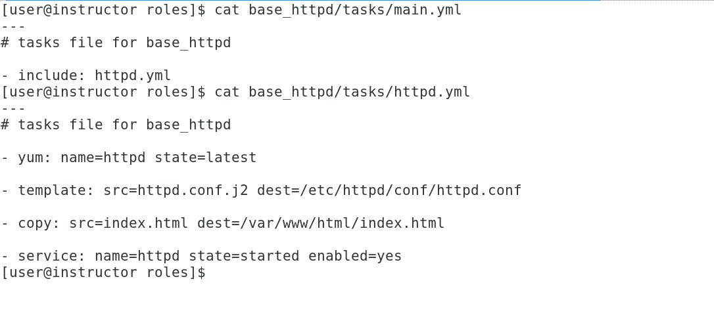
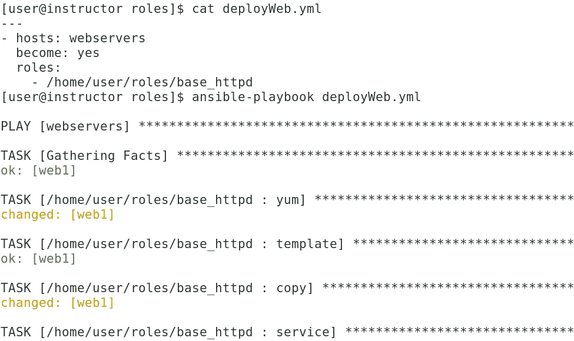

# 解释的角色|备忘单

> 原文：<https://acloudguru.com/blog/engineering/ansible-roles-explained>

角色是 Ansible 的一个强大特性，它有助于重用并进一步促进配置的模块化，但 Ansible 角色经常被忽略，而不是直接针对手头任务的[剧本](https://wpengine.linuxacademy.com/linux-academy/certified-ansible-specialist-the-playbook-for-success/)。好消息是，可行的角色很容易设置，并在必要时考虑到复杂性。请和我一起学习如何设置和部署一个简单的 Ansible 角色的基础知识。**奖励**:下载下面的角色备忘单！

## **对一个可能角色的剖析**

可承担角色的概念很简单；它是一组存储在标准化文件结构中的变量、任务、文件和处理程序。角色最复杂的部分是回忆目录结构，但是有帮助。内置的 *ansible-galaxy* 命令有一个子命令，可以为我们创建角色框架。只需使用`ansible-galaxy init <ROLE_NAME>`在当前工作目录中创建一个新角色。您将在这里看到在新角色中创建了几个目录和文件:

文件和目录的数量可能看起来吓人，但它们相当简单。大多数目录都包含一个 *main.yml* 文件；Ansible 使用这些文件中的每一个作为读取目录内容的入口点(文件、模板和测试除外)。您可以自由地将任务和变量分支到每个目录中的其他文件中。但是当你这样做的时候，你必须使用目录的 *main.yml* 中的***include***指令来让你的文件作为角色的一部分被利用。在简要概述了每个目录的用途后，我们将对此进行更深入的研究。defaults 目录是为优先级最低的变量默认值指定的。换句话说:如果一个变量没有在其他地方定义，将使用*defaults/main . yml*中给出的定义。 *文件* 和 *模板* 目录服务于类似的目的。它们分别包含在角色中使用的附属文件和 Ansible 模板。这些目录的美妙之处在于，Ansible 在使用该角色时不需要存储在其中的资源的路径。Ansible 首先检查它们。如果您想要引用角色之外的文件，您仍然可以使用完整路径，但是，最佳实践建议您将所有角色组件放在一起。handlers 目录用于存储 Ansible 处理程序。如果你不熟悉的话，Ansible 处理程序只是在游戏结束时运行的任务。根据您的角色需要，您可以拥有任意数量的处理程序。如果您选择在galaxy.ansible.com 上发布您的角色，元目录包含的作者身份信息会很有用。元目录也可以用于定义角色依赖性。正如您可能会怀疑的那样，角色依赖关系允许您要求在安装有问题的角色之前安装其他角色。 *README.md* 文件只是一个 markdown 格式的自述文件。这个文件对于发布到[galaxy.ansible.com](https://galaxy.ansible.com)的角色来说是必不可少的，老实说，这个文件应该包括你的角色如何运作的一般描述，即使你没有公开它。 *任务* 目录是你大部分角色将被编写的地方。该目录包括您的角色将运行的所有任务。理想情况下，每个逻辑上相关的任务系列都将被放置在它们自己的文件中，并通过 *main.yml* 文件简单地包含在 *tasks* 目录中。 *测试* 目录包含一个样本库存和一个 *test.yml* 剧本。如果您有一个围绕您的角色构建的自动化测试过程，这可能是有用的。当你正在构建你的角色时，它也可以是方便的，但是它的使用不是强制性的。最后创建的目录是 *vars* 目录。这是您创建变量文件的地方，这些文件为您的角色定义了必要的变量。此目录中定义的变量仅供角色内部使用。将您的角色变量名命名为命名空间是一个好主意，以防止与您的角色之外的变量发生潜在的命名冲突。例如，如果您在基线剧本中需要一个名为***config _ file***的变量，您可能希望将您的变量命名为***baseline _ config _ file***，以避免与其他地方定义的另一个可能的***config _ file***变量冲突。

## **创建一个简单的角色**

如前所述，可变角色可以根据您的需要而变得复杂或简单。有时，当您支持基本功能时，从简单的角色开始并迭代到更复杂的角色会很有帮助。让我们尝试一下，定义一个名为 *base_httpd* 的角色，用一个简单的配置和一个非常简单的网站安装 httpd。首先，我们需要创建我们的角色。我们可以手动创建每个目录和文件，但是让 *ansible-galaxy* 为我们完成繁重的工作要简单得多，只需运行`ansible-galaxy init base_httpd` : 接下来，我们可以在 files 目录中创建我们的简单网页。出于学术目的，我们可以创建一个名为*index.html*的文件，其中包含一些可靠的示例文本:

我们将通过从新安装的 httpd 中复制一个现有的模板来创建我们的 *httpd.conf* 文件的模板。让我们借此机会定义我们角色中的几个默认变量。我们将使用默认监听端口 80 和默认警告日志级别。我们可以通过在 *defaults/main.yml* : 中添加一个条目来实现这一点。你会注意到模板文件的扩展名为 *.j2* 作为自定义，我已经使用 grep 突出显示了我们已经通过用 Ansible 变量替换 *httpd.conf* 中的默认值来自定义模板的位置。然后我展示了变量在 *defaults/main.yml* 中的定义位置。**在这里使用默认值而不是变量是首选的**，因为它允许以后的定制而不必改变实际的角色。现在我们有了简单的网站和配置，我们需要创建任务来激活我们的 web 服务器。为了举例，我将把我们的 httpd 设置隔离到它自己的 yaml 文件中，该文件位于 *tasks/httpd.yml* 中，然后将该文件包含到 *tasks/main.yml* : 中，我们使用 yum、template、copy 和 service 模块来安装、配置和启动我们的 web 服务器。这里值得注意的是，我引用了没有完整路径的 *httpd.yml* 、 *httpd.conf.j2* 和*index.html*文件，因为它们存储在角色中。

## **部署角色**

当我们构建角色本身时，大部分艰苦的工作已经完成。相比之下，角色的部署很容易。我们只需要建立一个简单的剧本，并使用适当的关键字:引入角色，我们可以在角色部署之后轻松地添加典型的任务，或者我们也可以通过简单地将它们添加到列表中来部署额外的角色。此外，我们可以使用相同的变量名覆盖我们配置的默认变量，如下所示: Ansible roles 提供了一种健壮的方式来组织部署工件和任务，以便重用和共享。在 *ansible-galaxy* 中提供的工具使得建立一个新角色变得和以前一样简单。任何一个对编写可翻译剧本有基本了解的人都可以轻松地创建一个可翻译角色，[下载下面的备忘单供将来参考](https://linuxacademy.com/site-content/uploads/2019/05/Linux-Academy-Ansible-Roles-Cheatsheet.pdf)。 **要启动你的第一个免费的 Ansible 动手实验室**，[阅读这篇文章](https://linuxacademy.com/blog/ansible/launch-your-first-ansible-hands-on-lab-for-free/)。关于 Ansible 的其他阅读材料，这里有一些有趣的帖子: