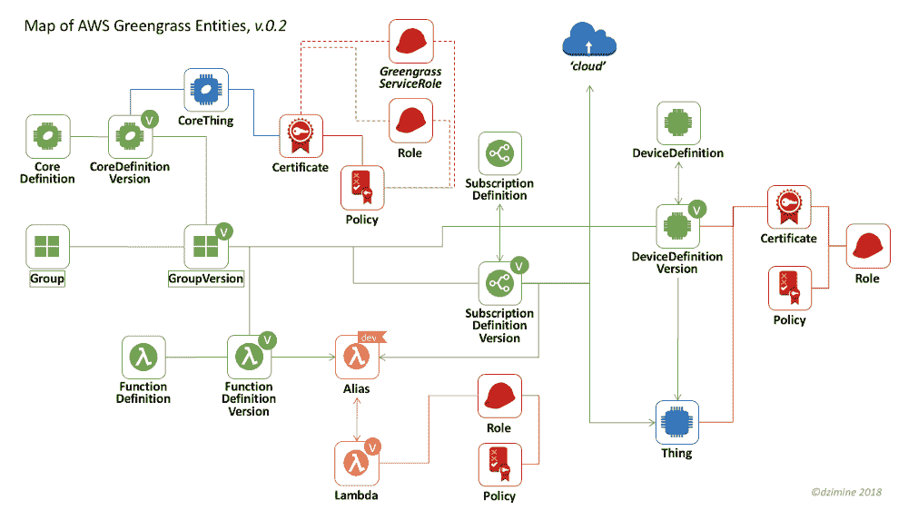

# AWS Greengrass API 教程和手册|云专家

> 原文：<https://acloudguru.com/blog/engineering/aws-greengrass-the-missing-manual>

Greengrass API 是一堆没有接线说明的备件，所以这里有一张地图、一个解释和一些代码:

[AWS Greengrass](https://aws.amazon.com/greengrass/) 是一项伟大的技术。如果你正在读这篇文章，你可能也已经这样想了。如果你没有——看看 [re:Invent keynote](https://youtu.be/1IxDLeFQKPk?t=2h33m35s%20or%20https://www.youtube.com/watch?v=4JuyF2zwFp0) 和[AWS green grass introduction](https://www.youtube.com/watch?v=1rLxPOxVJoQ)，你会被说服并受到启发去做黑客。

要掌握教程之外的 Greengrass，以自动化、可靠、可重复的方式定义和部署设置，必须使用 AWS API 或 CLI——我们长期生活在光明的 DevOps 世界中。

这里有一个大问题:虽然 Greengrass 上的 AWS 文档列出了各个呼叫，但它没有给出从哪里开始的线索。没有地图显示如何将电话连接在一起。所有零件都在适当的位置，但是装配手册不见了。或者，*是*失踪的——直到这篇帖子。

## AWS Greengrass 入门

我将从高层次开始:概念定义，模型图，一些关于事物如何工作的理论…但是我的千禧一代读者渴望通过实践来学习，所以让我们从一些工作代码开始。别担心，你仍然可以找到下面的地图和概念。

这是创建具有单个核心的 Greengrass 组的代码。

> 作为奖励，为了您的方便和即时满足，请将此代码记录在 [Jupyter 笔记本](https://github.com/dzimine/greengo/blob/master/misc/greengrass_create_core.ipynb)中！

当你点击 AWS 控制台中的一个“创建组”按钮来创建 *Greengrass Core，*下面提供的代码是场景中发生的事情。相当多…跨 3 个 AWS 服务的 7 个调用— 5 个显式创建的实体，2 个隐式创建的实体。

创建群组只是开始，您还需要:

*   用 AWS Lambda 创建 Lambda 函数
*   通过 Lambda 定义将它们注册到 IoT
*   为您的 Lambdas 定义要访问的资源
*   配置记录器和注册设备
*   为每个点对点通信设置 MQTT 订阅
*   将整个 shebang 部署到绿草核心

顺便说一下，所有这些都必须正确安装和配置，携带正确的证书，并在您的边缘设备上运行。如果听起来有点复杂，那是因为它*是*有点复杂。是时候提升概念和定位了。

### AWS Greengrass 操作流程

首先，让我们回顾一下绿草运营生命周期工作流程的步骤。

1.  **在 AWS IoT 中创建 Greengrass 组定义** —多次调用 AWS API 来创建和连接所有必要的实体。
2.  **设置 green grass core“on the edge”**—配置一个 box Raspberry Pi 或其他[兼容设备](https://aws.amazon.com/greengrass/faqs/#Greengrass_Core_Platform_Compatibility)，或用于开发&测试的 VM / Docker。下载并安装正确版本的 greengrass，放置证书，调整“config.json ”,并启动 Greengrass 守护程序。
3.  **部署** —告诉 AWS 将 Greengrass 组定义推送到 Greengrass 核心运行时。
4.  **清理** —步骤 1-3 会产生一系列工件，如果不正确回收，会污染您的 AWS 帐户。

### **AWS 温室模型**

接下来我们来了解一下模型。到目前为止，组定义(上面的步骤 1)是最复杂的。为了帮助你导航，我创建了一个“绿草实体地图”。虽然地图不是 AWS API 的拓扑精确表示，但它会帮助您掌握模型，不会迷路。

Greengrass 与其他 AWS 服务交织在一起，最明显的是 IoT、Lambda 和 IAM & security，它们在地图上以颜色编码。看一下地图。找出上面代码创建的对象。探索其余部分。尽情享受吧！

Please help make this map better — report *errors and omissions on the map *[*here*](https://github.com/dzimine/aws-greengrass-map/issues)*.*

> 为了减少混乱，LoggerDefinition 和 ResourceDefinition 块没有显示在地图上，因为它们相对简单，所以您可以在看到模式后进行推断。

绿草在概念上是 AWS 物联网的一部分，在视觉上是 AWS 控制台中物联网的一个板块。但在 API 级别，它是一种具有不同模型的独立服务——在概念、约定甚至命名方面都与物联网截然不同。

## AWS Greengrass 实体

在 Greengrass 中，每个实体都是有版本的，不可变的。任何修改都是通过用新创建的版本更新实体来完成的。版本包含所有数据和对其他 AWS 服务的引用。

### 群组版本

**团版** 模特的焦点是*团版*。只有在创建了*组版本*后，AWS 控制台中才会显示组清单。但是要创建一个*组版本*，你必须首先创建[一些其他实体](http://boto3.readthedocs.io/en/latest/reference/services/greengrass.html#Greengrass.Client.create_group_version)并提供给`[create_group_version](http://boto3.readthedocs.io/en/latest/reference/services/greengrass.html#Greengrass.Client.create_group_version)`调用。

### 绿草芯

**green grass Core** *green grass Core*具有双重性:在物联网端，它作为一个“*东西*”，或用于连接和通信的“设备”，在[物联网注册表](https://docs.aws.amazon.com/iot/latest/developerguide/thing-registry.html)中由物联网“*东西*”表示，并附带证书、角色和策略。在 Greengrass 端，它被公开为一个 *CoreDefinition/Version* 。

### λ函数和绿草

**Lambda 函数** Lambda 函数首先在 AWS Lambda 中创建，通过*function definition/Version*链接到 Greengrass。它还添加了一些额外的特定于 Greengrass 的 Lambda 参数——比如让 Lambda 长期运行的`pinned`标志、设备访问策略或额外的环境变量。

要被链接，Lambdas 必须被发布，并由一个[合格的 ARN](https://docs.aws.amazon.com/lambda/latest/dg/versioning-intro.html) 推荐——一个有版本或别名的 ARN(推荐)。我希望 AWS API doc 告诉我这一点——没有，如果您提供一个不合格的 ARN 作为`FunctionArn`，API 会抛出一个令人费解的“函数定义无效或损坏”消息。

### 绿草订阅

**订阅** *订阅*简单明了，但太冗长，难以定义:我觉得这很烦人，因为要用一堆订阅来定义设备、lambdas 和云之间的所有通信。怎么处理？参见下面的“基于文件的 Greengrass 设置方法”。

### AWS 物联网温室设备定义

**设备定义** *设备定义*将连接到核心的设备表示为物联网事物的链接——这些事物必须在 AWS 物联网中设置。考虑使用 ELF 为您的开发环境快速模拟一个设备。 *Logger 定义*告诉 Greengrass core 本地记录什么，发送什么到 CloudWatch。*资源定义*用于定义集团范围内对 Greengrass 核心设备资源的 Lambda 访问，附属于 Lambda *功能定义。*

> 哦，你有没有注意到 Greengrass AWS 控制台中的机器学习资源，现在 [AWS ML 推理已经普遍可用了？](https://www.youtube.com/watch?v=EiQ8kqnAkno)

关于地图已经说得够多了:探索它，跟踪并找到相应的 AWS API 调用来创建和连接实体。我考虑过在地图上标出确切的方法，但决定偏向美学，给你留下一些空间和发现的乐趣。

## 部署 AWS Greengrass

最后，谈谈基于文件的 Greengrass 部署方法。当我玩 Greengrass 时，我想要——但错过了——我习惯于享受 Ansible、Terraform 或无服务器框架的三样东西:

1.  基于文件的 Greengrass 组定义
2.  创建、部署和清理的一个命令
3.  简单、可表示、可重复的开发样板，带有虚拟机上的 Greengrass 核心(Docker？甚至更好！)

我错过了，所以我写了一个。有请[**greengo**](https://github.com/dzimine/greengo)——一个简单的基于文件的 Greengrass 配置工具。

把它作为你的 Greengrass dev 样板文件——根据你的喜好调整`greengo.yaml`,然后点击`greengo create`。或者使用 is 作为一个备忘单，找出如何用正确的参数以正确的顺序调用正确的 boto3 方法，就像您在上面的地图上跟踪链一样。

**就这样。**我希望上面的地图、代码示例、解释和 greengo 工具/备忘单能够填补 AWS 文档中的空白，并帮助您以自动化、可重复的方式、DevOps 风格操作 Greengrass。

绿草如茵快乐！

## 想要更多的云好吗？看看这些:

* * *

*想要扩展您的云技能和知识吗？查看云计算专家的云计算课程、实验室和学习途径！*

* * *

如果你觉得这本手册有用或有趣，我会为你鼓掌👏给小费。请在这里的评论里分享你的想法，或者在 Twitter 上关注我*[*@ dz 亚胺*](https://twitter.com/dzimine) *关于 IoT、DevOps、Serverless 的讨论和故事。**