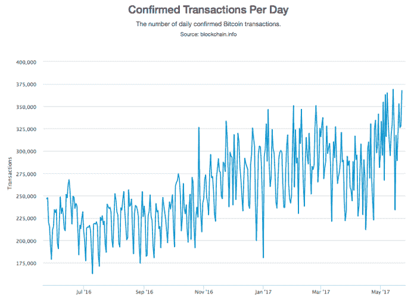
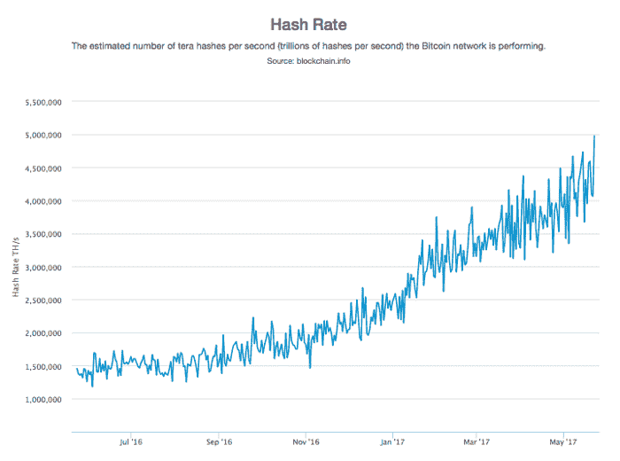
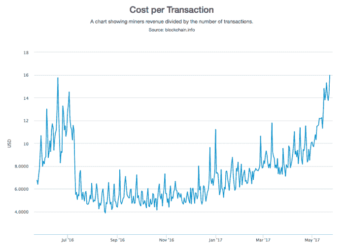
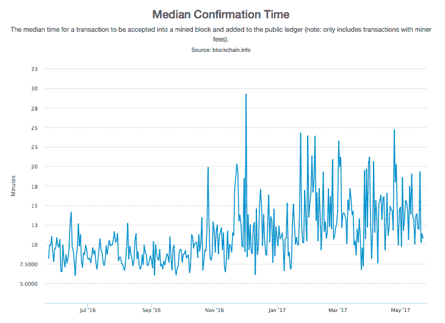
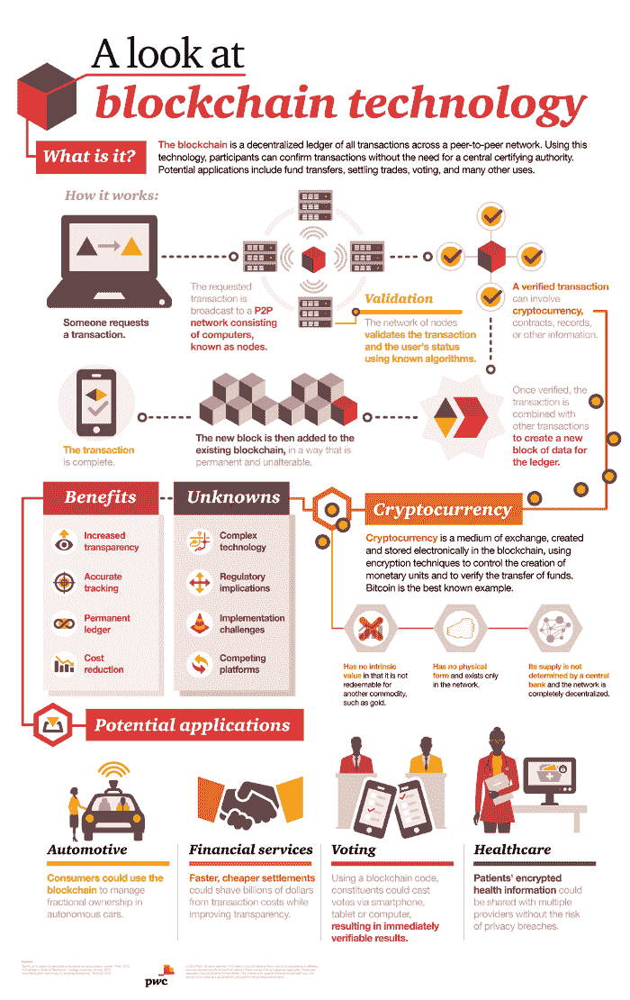

# 事件驱动架构:无服务器处理和区块链二重奏|云专家

> 原文：<https://acloudguru.com/blog/engineering/blockchain-and-serverless-processing-similarities-differences-and-how-they-fit-together>

随着应用模式向事件驱动架构发展，无服务器和区块链更有可能一起使用

## 区块链 vs 无服务器处理？

看一看相似之处和不同之处有助于更好地理解无服务器和区块链。更深入的分析还表明了每种技术可能会如何影响下一波计算周期。

Venn Diagram — Serverless and Blockchain

### 这一切加起来…总和大于他们的部分

在过去的几个月里，我花了很多时间潜入区块链的世界。就像无服务器计算一样，有很多东西需要消费和吸收。完成基本的工作流程、理解不同的平台以及将各种组件联系在一起需要相当大的努力。

几个月前，在与 New Stack 的 Lawrence Hecht 交谈后，我开始了我的区块链探索之旅。在我们的通话中，我们讨论了高比例的 Alexa 语音服务/Echo 应用程序如何使用 AWS Lambda 作为他们的主要处理引擎。换句话说，Alexa 加 Lambda 等于应用。

他的假设——我完全赞同——是无服务器处理与新兴的 API 驱动平台的结合将引领无服务器的采用。

> Alexa + Lambda =应用

毫无疑问，无服务器处理将触及 IT 计算的几乎所有领域。但这一理论暗示，最快速的增长和采用将是与新平台的结合。换句话说，新平台加上无服务器处理等于更高的增长率。

因为这些应用程序是从零开始的，所以不需要担心遗留代码或现有架构。无服务器处理支持快速开发和快速规模化。因此，对于希望快速开发应用程序并轻松扩展它们的人来说，这是一个明智的选择。

另一个驱动因素是新的应用程序通常是事件驱动的——或者至少有大量的事件处理需求。这一特性有助于微服务和功能即服务(FaaS)架构。无服务器处理提供的新工具非常适合处理事件驱动的计算模式。

> 新平台+无服务器=许多应用

由于这个原因，我相信区块链和无服务器的组合将远远大于他们的部分。这种结合将成为构建和支持区块链相关应用的主要方法——尤其是在涉及专用区块链网络时。

## 区块链技术解释

在探索区块链的世界时，我发现大多数出版的材料要么太高级，要么太热情，要么太深入密码学和共识算法。缺少的是一个清晰的解释——针对架构师和开发人员——它解决了关于构建基于区块链的商业应用程序的实际问题。

### 区块链和数字货币不一样

数字货币基于区块链——这种货币的存在是因为区块链技术。数字货币交易本质上是由区块链的处理和存储特性进行公证的。换句话说，货币的价值受到连锁散列块和网络分布的保护。

如果不是不可能，数字货币很难存在于分布式区块链网络之外。要实现这一点，数字货币必须相信一个单一的可信实体，并希望它不会欺骗系统、被黑客攻击，也不会增加货币供应量。很少有数字货币的追随者愿意相信这些选择。

区块链网络由数字货币驱动。运营网络内节点的组织通过在系统内使用数字货币获得奖励。例如，在比特币网络中处理交易的付款是用比特币支付的。以太坊平台上的处理通过以太支付——以太坊使用的硬币。

您知道非货币资产也可以交易，并且交易可以在区块链内保留吗？

由于区块链技术也可用于数字货币以外的应用，因此该领域存在大量活动和投资。公司正在使用区块链技术创建基于交易的解决方案，以安全且易于验证的方式交易和转移实物和数字资产。

在传统的市场和交易平台中，交易存储在一个由单一实体拥有的集中分类账中。区块链平台允许这些交易进行数字签名，并作为不可改变的记录保存下来。它还将交易存储在跨多个独立和复制节点的分布式分类帐中。

在其核心，一个完全形成的区块链网络成为设计交易关系规则的机制。区块链网络充当程序化裁决或最终解决，减少了向人类机构上诉的需要。结果，区块链变成了一个可编程的社会契约，允许各方之间以非常低的成本进行可信的、有效的和有记录的交互。

## 什么是区块链网络？

区块链网络由几乎相同的节点组成，这些节点以分布式但独立的方式运行。节点网络用于验证事务集，并将它们封装在链中的块内。区块链平台的核心是一个分布式事务处理引擎，用于验证和加密密封事务。

这些事务在分布式分类帐中维护，该分类帐在任何参与节点中复制、共享和同步。区块链使用加密技术来创建永久交易记录。一组事务以密码方式存储在“块”中。连续的数据块被添加到一个链中，使用哈希算法进行保护并按顺序保存。

比特币和以太坊等区块链公共账户存储在世界各地的数千个节点中。另一方面，专用区块链网络可能只有几个节点。通常情况下，区块链网络中的任何完全参与者都希望维护一个活动的、正在运行的节点，以确保分类帐的有效性独立于其他任何人。

账本的加密和共享特性使得对真相的一致记录成为可能。这对解决区块链试图解决的几个问题至关重要:

1.  消除对真理中心来源的需求
2.  当各方对交易状态有争议时，消除争议

区块链是在网络参与者之间共享的真理的一致记录。它成为最终的仲裁者——消除任何形式的“他说，她说”的争议。

Reprinted from BT (bt.com)

## 什么是区块链平台？

如前所述，有许多区块链平台。虽然比特币是最受欢迎的加密货币，但以太坊拥有最受欢迎的区块链平台之一——尤其是在数字货币商店之外的用途上。Hyperledger 是一个 Linux 基金会项目，得到了大型金融和技术机构的大力支持。从使用它的项目数量和社区支持水平来看，它也很受欢迎。

区块链网络可以是公共的、私有的或混合的。这意味着公共交易将被加密到公共分类账中，而私人交易将被存储在私人分类账中。私人交易也可以存储在公共分类账中，因此有混合名称。

为了支持混合用例，企业以太坊联盟正在努力保持公共以太坊网络和私有平台的兼容性。据一位监督这项工作的消息人士称，该组织的一个大话题是在许可的或私人的区块链进行私人交易。大通银行的以太坊 Go 客户端的分支( *Quorum* )增加了私人交易——只有发送者和接收者知道交易的细节。然而，与公共链的交互的兼容性仍然是一个驱动原则。

### **数字货币、代币和资产**

数字货币与特定的区块链联系在一起。涉及特定货币的交易在该货币的分布式区块链中被表示、标注和体现。

比特币交易在比特币平台上处理，存储在比特币账本中。以太坊交易在以太坊平台上处理，并存储在以太坊分布式分类账中。Hyperledger 交易在 Hyperledger 平台上处理，并存储在 Hyperledger 分布式分类帐中。诸如此类。

一些区块链将数字代币作为二级资产或货币。这些资产以基础数字货币定价。数字令牌通常可以用于区块链平台内的特定应用或子平台上的服务。查看一下[令牌市场](https://tokenmarket.net/blockchain/ethereum/assets/)中的列表，将会显示以太坊区块链下可用的数字资产。

例如，设想一种优步数字令牌，它可以用作任何优步区块链支持服务的货币。这项服务可以简单地从你优步账户中的任何一个优步数字代币中提款。代币可以与以太网等数字货币挂钩，或者只是建立在平台上，并在平台内获得或失去价值——以及通过投机利益。

数字代币正在 ICOs 中发行——最初的硬币发行。在某些方面，这类似于 19 世纪和 20 世纪初的预注册股票发行。任何实体都可以创建令牌并在 ICO 中出售。交易将以区块链数字货币进行。

> 《区块链新闻》引用的一份报告指出，在区块链公司筹集的 2 . 5 亿美元 1B 投资中，有四分之一是 ico 的成果。

*数字资产*简单来说就是指处于交易核心的数字或实物项目。可以购买和转让的资产包括房子、汽车、公司股份或一幅画。这些交易将在一个区块链中登记，并且该资产成为交换中的参考项目。一批货物也可以被视为一组区块链交易的核心资产——这是一个已经在运作的区块链用例。

### **区块链平台是处理引擎**

所有区块链平台都包含一个处理组件，这是事务保证的关键部分。区块链网络是为“矿工”建立的，他们竞相“锻造”每一个区块链。

术语*采矿*和*伪造*用于描述验证和保存大宗交易的过程，以及接收新的数字货币代币作为工作回报。挖掘过程以合理的固定频率将新货币引入系统。

矿工会因为第一个解决区块方案而得到补偿。这意味着第一个为该块计算小于由网络的任意机制设置的任意阈值的散列。区块链平台在设置和调整阈值方面进行自我仲裁，这允许聚集的矿工在特定和定期的时间窗口内开采区块。

所有矿工都可以接触到每笔交易。作为伪造一个块或一组事务的一部分，他们处理每个事务的代码，并试图得到散列解决方案。

> 在《[比特币挖矿详解](https://blog.gravity.eco/down-the-mineshaft-bitcoin-mining-explained)》一文中，作者提供了详细的过程说明。它描述了每个块的散列是如何使用它之前的块的散列产生的，从而成为蜡封的数字版本。这个过程确认这个块以及它之后的每个块都是合法的，因为如果你篡改了它，每个人都会知道。

区块链处理的这种分布式特性意味着每个活动节点理论上可以执行系统中的每个事务。例如，公共数字货币从一个人到另一个人的转移可能会被整个网络中的每个节点处理。

在比特币或以太网的情况下，这可能意味着超过 10，000 个节点正在执行给定交易的代码。无论是简单的数字资产转移，还是处理逻辑极其复杂的事务，每种类型的事务都会进行相同的处理复制。

Number of Bitcoin Transactions Per Day — Theoretically executed by every node in the network
Source: blockchain.info

Estimated Number of Hashes Per Second on Bitcoin Blocks
Source: blockchain.info

### 为处理交易的智能合约编码

每笔交易的代码称为*智能合约*，处理称为*链上*处理。

在以太坊的情况下，智能合约是用 Solidity 编写的，Solidity 是一种面向合约的高级语言，其语法类似于 JavaScript，旨在针对以太坊虚拟机(EVM)。

函数作为创建资产类型过程的一部分上传。在区块链中，语言和处理模型的一致性确保了高度的等幂性，这意味着在系统内的每个节点上执行智能合同的结果应该是相同的。

对于 Hyperledger 结构，智能合同处理在 Go 中执行。OCaml 语言被用于一个新的区块链平台，预计将于 2017 年 6 月发布。根据 CryptoAcademy 的说法，“OCaml 是一种强大的函数式编程语言，它提供了速度、明确的语法和语义，以及一个生态系统，这使得 Tezos 成为正确性正式证明的良好候选。”

在公共区块链网络中，处理交易需要付费，费用由提交交易的一方承担。在以太坊的情况下，处理费用被称为“气体”，它作为交易的一部分以以太坊的基础货币*以太*的形式提交。

然而，专用区块链网络在交易成本计算方法方面可以更加灵活。运营成本可以由网络参与者以很少或没有成本的方式来承担，或者可以由网络参与者确定的方式来记账。

Cost per Bitcoin Transaction
Source: blockchain.info

各种区块链平台正在努力改进达成处理共识的形式。现在的形式叫做工作证明。以太坊网络中提出的一种方法叫做利益证明。你可以在这里[这里](https://ethereum.stackexchange.com/questions/118/whats-the-difference-between-proof-of-stake-and-proof-of-work)和[这里](https://steemit.com/crypto-news/@dana-edwards/tezos-the-generic-self-amending-crypto-ledger)阅读提案和辩论[。](https://blockgeeks.com/guides/proof-of-work-vs-proof-of-stake/)

区块链可能会对我们交易资产、存储资产、实施食品安全监管、记录医疗保健中的患者信息、执行供应链管理、选举投票等方式产生影响。加入我们这个有趣的[区块链认证](https://acloudguru.com/course/blockchain-essentials)课程，深入区块链的世界。

## 比较区块链和无服务器处理

区块链处理模型与无服务器处理有很大不同。不仅大多数无服务器平台支持多种语言，而且无服务器处理的目标是一次性处理。

在并发的基础上处理相同的事务是与无服务器处理理念相对立的。但是，在区块链平台中，这种并发的相同处理模式是一个关键特性，它确保并维护区块链作为交易历史和当前状态的一个经过验证的可信来源。

鉴于区块链处理的封闭性，没有必要——也没有任何进入方式——为执行智能合同而对链上交易进行无服务器处理。然而，对于处理链外交易有着巨大的需求——特别是在设置交易、帮助完善交易以及处理交易后工作流方面。

为什么有这样的外链交易的需求？原因是 1)链上处理能力严重受限，2)链上数据存储严重受限。因此，对于复杂和/或数据量大的交易，需要进行离线数据处理。

关于有限处理能力的第一个问题，为了达到有效的事务吞吐量，需要将链上事务逻辑保持在最低限度。处理交易的成本机制——为处理交易和操作分类账提供公平回报的机制——也会产生交易成本。

如果交易过程中不收取“汽油”费用，交易各方就可以在网络上免费搭车。此外，他们可以轻易地压倒网络的处理能力——区块链 DDOS 攻击任何人？

为了达到每个事务的性能、成本和一致性的最佳平衡，区块链应用程序的事务逻辑需要充分处理链上处理和链下处理。这也适用于处理链上数据和链外数据。因此，有效的区块链设计意味着将区块链网络仅用于完善和维护交易所需的最少量的数据处理和数据存储。

### **一盘比较链上的棋&链下的棋**

最近[的一篇帖子](https://medium.com/@graycoding/lessons-learned-from-making-a-chess-game-for-ethereum-6917c01178b6)描述了如何使用以太坊网络作为一种验证国际象棋游戏的机制，从而说明了*链上和链下*的区别。

作者保罗·格劳(Paul Grau)描述了将每一步都作为交易提交到供应链中是多么不切实际。每笔交易不仅要花费大量的时间来结算，而且由于交易成本的原因，还可能成本过高。例如，玩家的移动可能需要几秒钟，而将移动提交给区块链可能需要几分钟。

在评估问题时，团队意识到每一步都不需要成为链条的一部分。独立仲裁——区块链处理——仅在确立游戏开始以及解决游戏中的争议时需要。一旦游戏建立，每个玩家将他们的移动连同他们对游戏的感知状态一起提交给对方玩家，作为离线的签名交易。如果对方玩家签名并提交后续移动，则先前的移动被视为接受。

只有在有争议的情况下——玩家认为存在将死、僵局或超时的情况，交易才会提交给区块链。

在这种情况下，智能合约的处理将确定这种条件是否为真，从而决定结果或下一步——继续游戏、宣布赢家或僵持。不可避免地会出现智能链逻辑应该和能够有多复杂的问题。以国际象棋为例，有人建议可以创建一个相当快速的算法来评估智能合同中的条件。然而，更复杂的游戏，如围棋，则是另一回事。

Median Time for Transaction to be Accepted into a Mined Bitcoin Block
Source: blockchain.info

### **链外处理和数据怎么样？**

链上处理和链外处理的分离意味着链外处理需求必须能够设置事务和管理任何后处理需求。请记住，区块链提供了可信的交易记录，但是利用该交易的各方不需要以链上的方式这样做。

例如，使用区块链验证选民资格的投票应用程序可以访问区块链记录进行确认。除了注册投票之外，它的任何处理都不需要在区块链平台内进行。同样，使用区块链分类帐保存汽车的事故和维修历史记录会将事件提交到区块链，但对这些事件执行的任何操作都不需要以链上方式进行。

在链上存储数据的限制也与无服务器处理直接相关。任何支持交易的数据都需要作为交易的一部分进行数字保存和链接，就像在区块链中记录的实际合同一样。已经开发了在几个公共区块链中执行该功能的服务。例如，Tierion 正在为基于以太坊的应用程序执行此操作。对于专用区块链网络，无服务器处理的潜在候选包括准备数据、验证数据和访问数据的后处理。

链内处理和链外处理的区别很大程度上归结于信任级别。链上处理被设计成*无信任*——这意味着各方不必为了完善交易而相互信任。由一方在无服务器环境中执行的离链处理适用于以下情况:1)没有实现交易，2)两方或多方相互信任以放弃任何种类的共识算法，或 3)存在共识算法来验证离链处理的结果。

### 事件驱动架构的催化剂

区块链和无服务器处理是两项独立的技术创新，它们明显不同，但它们有许多共同点。虽然无服务器旨在实现无状态，但区块链提供了一种公开且可独立验证的方式来维护事务状态。

随着应用程序模式快速发展到事件驱动的架构，对独立可验证的事务状态的需求将会增加——无服务器和区块链更有可能一起使用。这种组合的用例尤其适用于私有和/或允许的区块链，在那里信任级别更高，允许使用外部组件和服务的程度更高。

### 下一步是什么？

下一篇文章将更深入地探索区块链平台和组件，并深入探讨区块链平台试图解决的一些问题。此外，我们将讨论一些领域，无服务器平台可以在这些领域构建钩子，以更好地支持区块链应用程序的开发和操作。

* * *

*想要扩展您的区块链和无服务器技能吗？云专家的培训图书馆拥有广泛的课程、学习途径和实验室！*

* * *

**What is the difference between blockchain and serverless computing?**

从表面上看，区块链网络和无服务器计算似乎没有什么共同之处。无服务器是无状态的，区块链是有状态的；无服务器是短暂的，区块链是持久的；无服务器处理依赖于各方之间的信任，区块链被设计成无信任的；无服务器具有高可扩展性，区块链具有低可扩展性。

**How is blockchain and serverless computing similar?**

仔细观察，无服务器和区块链实际上有相当多的共同点。比如两者都是事件驱动，高度分布式。另一个关键的相似之处是它们都在基础架构/服务器级别之上的层中处理功能。即使这些特征不相同或不相似，它们也是互补的。例如，无服务器是无状态的——但是区块链可以用作验证事务的状态机。

**What are the blockchain platforms?**

有许多区块链平台。虽然比特币是最受欢迎的加密货币，但以太坊拥有最受欢迎的区块链平台之一——尤其是在数字货币商店之外的用途上。Hyperledger 是一个 Linux 基金会项目，得到了大型金融和技术机构的大力支持。

****What is on-chain and off-chain processing?****

链上处理和链外处理的分离意味着链外处理需求必须能够设置事务和管理任何后处理需求。链内处理和链外处理的区别很大程度上归结于信任级别。链上处理被设计为*无信任*，而链外处理由一方在无服务器环境中执行

### 想要更多的技术优势？看看这些:

* * *

*感谢阅读！如果你喜欢你所读的，点击下面的❤按钮，以便其他人可以找到它。可以* [*在 Twitter 上关注我*](https://twitter.com/frommww) *。*