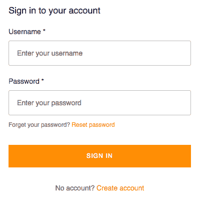
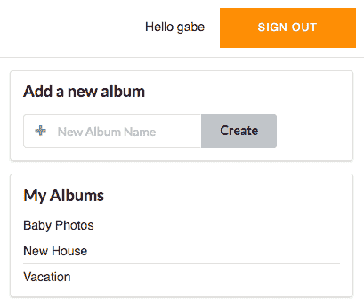

# 使用 React、GraphQL 和 AWS Amplify 构建您自己的多用户相册应用程序—第 1 部分，共 3 部分|云专家

> 原文：<https://acloudguru.com/blog/engineering/build-your-own-multi-user-photo-album-app-with-react-graphql-and-aws-amplify-part1>

*引导我们的应用程序，添加认证，并集成一个 GraphQL API*

***第 1 部分|*** [***第 2 部分***](https://acloudguru.com/blog/engineering/build-your-own-multi-user-photo-album-app-with-react-graphql-and-aws-amplify-part2)***|***[***第 3 部分***](https://acloudguru.com/blog/engineering/build-your-own-multi-user-photo-album-app-with-react-graphql-and-aws-amplify-part3) *这是一个三部分系列的第一篇文章，向您展示了如何在 AWS 上构建一个可伸缩且高度可用的[无服务器 web 应用](https://acloudguru.com/blog/engineering/six-months-of-serverless-lessons-learned)，允许用户将照片上传到相册并与他人私下共享这些相册。*

**注意:**自从这个系列的最初出版以来，我已经将这些内容改编成了一个可在线访问的自定进度的研讨会，网址:【https://amplify-workshop.go-aws.com/】

像这样的应用程序需要一些移动部件:

*   允许用户注册和认证，所以我们知道谁拥有哪些相册，所以用户可以邀请其他用户到他们的相册
*   构建一个 API 服务器，这样我们的前端就有办法加载适当的相册和照片来显示给定的用户
*   存储关于相册、照片和谁可以查看什么的权限的数据，以便我们的 API 有一个快速可靠的地方来查询和保存数据
*   存储和提供照片，这样我们就有地方存放用户上传到相册的所有照片
*   自动创建照片缩略图，因此当用户浏览相册的照片列表时，我们不需要提供全分辨率的照片

如果我们试图构建可伸缩的、高度可用的系统来独自处理上述每一个问题，我们可能永远也不会着手构建我们的应用程序！幸运的是，AWS 提供了服务和工具来处理构建现代、健壮的应用程序所涉及的大量无差别的繁重工作。我们将在我们的解决方案中使用许多这样的服务和工具，包括:

如果您对这些服务中的任何一项或全部都不熟悉，请不要担心。这些系列将涵盖您开始使用这些服务所需了解的一切。没有比构建更好的学习方式了，所以让我们开始吧！

### 我们将在这篇文章中讨论的内容

在这个系列的第一篇文章中，我们将为我们的应用程序打下基础，并让我们自己进入一个用户登录应用程序后可以创建和查看相册记录的地方。以下是我们将在下面介绍的步骤列表:

*   用 React 引导我们的 web 应用程序
*   添加用户身份验证
*   部署 GraphQL API 来管理相册数据
*   将我们的 web 应用程序连接到 API，让用户创建和列出相册，并实时更新

### 先决条件

在我们开始之前，有几件事你需要确定你已经设置好了，这样你就可以跟着做了。

**AWS 账户**–如果你还没有，你需要一个 AWS 账户。创建一个 AWS 帐户是免费的，让您可以立即访问 AWS 免费层。欲了解更多信息或注册账户，请参见 https://aws.amazon.com/free/

**Node.js 已安装**–我们将使用一些需要安装 Node.js(和 Node.js 附带的 NPM)的 JavaScript 工具和软件包。你可以在 https://nodejs.org/en/download/[的](https://nodejs.org/en/download/)下载一个安装程序或者找到安装 Node.js 的说明

**安装和配置的 AWS Amplify CLI**–[AWS Amplify CLI 可帮助您快速配置无服务器后端](https://acloudguru.com/blog/engineering/serverless-functions-in-depth)，包括对认证、分析、功能、REST/graph QL API 等的支持。遵循 https://github.com/aws-amplify/amplify-cli 的[的安装说明。Windows 用户请注意:AWS Amplify CLI 目前仅在用于 Linux 的](https://github.com/aws-amplify/amplify-cli) [Windows 子系统下受支持。](https://docs.microsoft.com/en-us/windows/wsl/install-win10)

### 启动我们的应用

我们将开始使用`create-react-app` CLI 工具构建一个新的 React web 应用程序。这将为我们提供一个带有本地自动重载 web 服务器的 React 示例应用程序，以及一些对浏览器有用的 transpiling 支持，比如让我们使用 async/await 关键字、arrow 函数等等。你可以在 https://github.com/facebook/create-react-app 的[了解更多关于这个工具的信息。运行该工具使用安装在 Node.js 旁边的命令`npx`,这使得运行包含在 NPM 包中的二进制文件变得容易。](https://github.com/facebook/create-react-app)

从命令行中，导航到您想要为此项目创建新目录的目录。

运行`npx create-react-app photo-albums`(如果你不喜欢“相册”,你可以使用任何你想要的名字，但是对于这些说明，我假设你称它为“相册”。

该命令将创建一个新的相册目录，其中包含一个基本的 React web 应用程序和一个运行本地开发 web 服务器的有用脚本。在我们开始编写 UI 之前，我们还将包括 React 的语义 UI 组件，为我们提供有助于使我们的界面看起来更好的组件。

运行`npm install --save semantic-ui-react`并通过编辑`public/index.html`来集成默认样式表，并将这个样式表链接添加到`<head>`部分:`<link rel="stylesheet" href="//cdnjs.cloudflare.com/ajax/libs/semantic-ui/2.3.3/semantic.min.css"></link>`

现在，让我们启动我们的开发服务器，这样我们就可以进行更改，并在浏览器中实时看到它们的刷新。

从`photo-albums`目录中，运行`npm start`。过一会儿，您应该会看到一个浏览器窗口向 [http://locahost:3000/](http://locahost:3000/) 打开，窗口上有 React 徽标和一些其他内容。

接下来，我们想要从头开始，所以让我们编辑`src/App.js`并将其更改为显示一条简单的“Hello World”消息。用以下内容替换文件的现有内容:

```
// src/App.js
import React, { Component } from ‘react’;
import { Header } from 'semantic-ui-react';
class App extends Component { 
  render() { 
    return (
      <div>
        <Header as='h1'>Hello World!</Header>
      </div>
    );
  }
}
export default App;
```

此时，浏览器应该会自动刷新并显示一个简单得多的页面，只有一些显示“Hello World”的文本。这还不算多，但是从尽可能少的标记开始是好的，这样我们就能理解我们添加的所有东西。

### 用四行代码添加用户验证

现在我们有了一个简单的 React 应用程序，让用户注册并登录我们的应用程序。他们还不能做任何事情，但这将是有帮助的，这样当我们添加查询后端 API 的能力时，我们将知道哪些用户正在访问我们的系统。

AWS Amplify CLI 使我们能够轻松地将云功能添加到我们的 web 和移动应用程序中，SDK 可用于 React 和 React Native、iOS 和 Android。首先，我们将创建一个新的应用程序并启用用户身份验证。然后，我们将使用开源的 [AWS Amplify](https://aws-amplify.github.io/) JavaScript 库在我们的应用程序中进行连接，AWS Amplify CLI 将负责为我们进行配置；我们所要做的就是在我们的 React 应用中使用它。AWS Amplify 包含一些用于云服务的很好的抽象，它有一些有用的 React 组件，我们将在我们的应用程序中使用。



AWS Amplify’s default sign-in screen looks great

在命令行中，确保您在`photo-albums`目录中，并且:

1.  运行`amplify init`
2.  选择您喜欢的编辑器
3.  选择 JavaScript 并在提示时做出反应
4.  当提示输入路径和构建命令时，接受默认值

这将为我们创建一个新的本地配置，我们可以用它来建立一个 [Amazon Cognito](https://aws.amazon.com/cognito/) 用户池，作为后端让用户注册和登录(我将在下面两段解释更多关于 Amazon Cognito 和什么是用户池)。如果你想了解更多关于这个步骤的信息，请看一下 [AWS Amplify 认证指南](https://aws-amplify.github.io/amplify-js/media/authentication_guide.html)中的“安装和配置”步骤。

使用 Amplify CLI 启用用户登录时，默认设置将要求用户使用复杂的密码进行注册，并在登录前确认其电子邮件地址的所有权。这些对于生产应用程序来说都是很好的设置，尽管完全可以自定义这种配置，但我们还是坚持使用这些默认设置。

运行`amplify add auth`向应用添加认证。当询问您是否想使用默认的认证和安全配置时，选择“是”*。然后，如输出文本所示，运行`amplify push`。Amplify CLI 将负责提供适当的云资源，并将使用我们在应用中使用云资源所需的所有配置数据更新`src/aws-exports.js`。*

*恭喜您，您刚刚创建了一个用于用户注册和授权的无服务器后端，能够通过 Amazon Cognito 扩展到数百万用户。Amazon Cognito 让您可以快速轻松地将用户注册、登录和访问控制添加到您的 web 和移动应用程序中。我们刚刚创建了一个用户池，这是一个安全的用户目录，允许我们的用户使用他们在注册时创建的用户名和密码登录。Amazon Cognito(和 Amplify CLI)还支持通过 SAML 2.0 配置社交身份提供商(如脸书、谷歌和亚马逊)和企业身份提供商的登录。如果你想了解更多，我们在[亚马逊 Cognito 开发者资源页面](https://aws.amazon.com/cognito/dev-resources/)以及 [AWS Amplify 认证文档](https://aws-amplify.github.io/amplify-js/media/authentication_guide#federated-identities-social-sign-in)上有更多信息。*

*既然我们已经为管理注册和登录设置了后端，我们需要做的就是使用 AWS Amplify 的`withAuthenticator` [高阶 react 组件来包装我们现有的应用程序组件。这将负责呈现一个简单的 UI，让用户注册、确认他们的帐户、登录、注销或重置他们的密码。](https://aws-amplify.github.io/amplify-js/media/authentication_guide.html#using-components-in-react)*

*我们还没有将`aws-amplify`和`aws-amplify-react`模块添加到我们的应用程序中，所以运行`npm install --save aws-amplify aws-amplify-react`，然后我们就可以在我们的应用程序中使用它们了。来更新一下`src/App.js`:*

```
*`// src/App.js

// 1\. NEW: Add some new imports
import Amplify from 'aws-amplify';
import aws_exports from './aws-exports';
import { withAuthenticator } from 'aws-amplify-react';
Amplify.configure(aws_exports);

// 2\. EDIT: Wrap our exported App component with WithAuthenticator
export default withAuthenticator(App, {includeGreetings: true});`*
```

*回头看看我们的浏览器(重启服务器后)，我们现在有了一个简单的注册/登录表单。尝试在应用程序中注册，提供用户名、密码和电子邮件地址，以便在需要重置密码时使用。你会被带到一个屏幕，要求你确认一个代码。这是因为 Amazon Cognito 希望在允许用户登录之前验证他们的电子邮件地址。去检查你的电子邮件，你应该会看到一个确认码信息。将该代码复制并粘贴到您的应用程序中，然后您应该能够使用您在注册时输入的用户名和密码登录。一旦您登录，表单消失，您可以看到我们的`App`组件呈现在一个标题栏下，其中包含您的用户名和一个“注销”按钮。*

*这是一个非常简单的身份验证 UI，但是您可以做很多事情来定制它，包括用您自己的 React 组件替换部分，或者使用可以重定向回您的应用程序的完全托管的 UI。更多信息参见 [AWS Amplify 认证指南](https://aws.github.io/aws-amplify/media/authentication_guide#customization)的定制部分。*

### *创建无服务器的 GraphQL API 后端*

*现在我们已经验证了用户，让我们制作一个创建相册的 API。这些相册中目前还没有任何照片，只有一个名称以及与创建它们的用户名的关联，但这是朝着整合我们的应用迈出的又一大步。*

*为了构建我们的 API，我们将使用 [AWS AppSync](https://aws.amazon.com/appsync/) ，这是一个托管的 GraphQL 服务，用于构建数据驱动的应用。如果你还不熟悉 GraphQL 的基础知识，我建议你在继续之前花几分钟查看一下 https://graphql.github.io/learn/的，或者在阅读过程中有问题时使用该网站查阅。*

*

AWS AppSync: Rapid prototyping and development with GraphQL* 

*AWS AppSync 还使向您的应用程序添加实时和离线功能变得非常容易，我们将在本文的结尾添加实时订阅，但让我们从基础开始:创建一个 AWS AppSync API，添加一个简单的 GraphQL 模式，并将其与 DynamoDB 连接以将我们的数据存储在 NoSQL 数据库中。同样，Amplify CLI 大大简化了这一过程。*

*在您的终端上，运行`amplify add api`并响应如下提示:*

```
*`$ amplify add api 
? Please select from one of the below mentioned services: GraphQL 
? Provide API name: photoalbums 
? Choose an authorization type for the API: Amazon Cognito User Pool 
? Do you have an annotated GraphQL schema? No 
? Do you want a guided schema creation? Yes 
? What best describes your project: One-to-many relationship 
? Do you want to edit the schema now? Yes 
Please edit the file in your editor: photo-albums/amplify/backend/api/photo-albums/schema.graphql`*
```

*此时，您的代码编辑器应该向您展示一个一对多 GraphQL 模式的示例，用一些@model 和@connection 位进行了注释。Amplify CLI 将把这个模式转换成一组数据源和解析器，以便在 AWS AppSync 上运行。你可以点击了解更多关于 [Amplify 的 GraphQL 变换。](https://github.com/aws-amplify/amplify-cli/blob/master/graphql-transform-tutorial.md)*

*下面是一个适合我们存储和查询相册和照片的模式。将它复制并粘贴到您的编辑器中，替换示例模式内容，并记住保存文件:*

```
*`# amplify/backend/api/photo-albums/schema.graphql

type Album @model {
  id: ID!
  name: String!
  owner: String!
  photos: [Photo] @connection(name: "AlbumPhotos")
}

type Photo @model {
  id: ID!
  album: Album @connection(name: "AlbumPhotos")
  bucket: String!
  fullsize: PhotoS3Info!
  thumbnail: PhotoS3Info!
}

type PhotoS3Info {
    key: String!
    width: Int!
    height: Int!
}`*
```

*现在回到你的命令行，按一次`Enter`继续。*

*最后，运行`amplify push`并确认您想要继续更新。然后稍等片刻，在云中调配新资源。*

*打开 AWS AppSync web 控制台，找到与您在上面输入的名称匹配的 API，然后单击它。现在我们可以开始研究 API 了。*

*真正酷的事情是，在这一点上，无需编写任何代码，我们现在有了一个 GraphQL API，它将允许我们对我们的`Album`和`Photo`数据类型执行 CRUDL 操作！但是不要担心，AWS AppSync 将字段解析为数据的方式不会对我们隐藏。每一个自动生成的解析器都可供我们随意编辑，我们稍后会讲到。现在，让我们尝试添加一些相册，然后将它们作为一个列表进行检索。*

*点击侧边栏中的“查询”部分。这个区域是 AWS AppSync 的交互式查询浏览器。我们可以在这里编写查询和变异，执行它们，并查看结果。这是一个很好的测试方法，可以确保我们的解析器按照我们期望的方式工作。*

*在发出查询之前，我们需要进行身份验证(因为我们的 AppSync API 被配置为通过 Amazon Cognito 用户池对用户进行身份验证，该用户池是我们在为应用程序配置身份验证时设置的。*

*

The AWS AppSync web console allows you to authenticate with your API before issuing queries* 

1.  *在 AppSync web 控制台的“查询”部分，请注意查询编辑器顶部有一个“使用用户池登录”按钮。单击按钮。*
2.  *在“ClientId”字段中，我们需要从我们的 Cognito 用户池配置中粘贴一个值。找到正确价值的一个地方是查看 React web 应用程序中的`src/aws-exports.js`。该文件由 Amplify CLI 生成，包含我们应用程序的大量配置值。我们想要复制并用于该字段的是`aws_user_pools_web_client_id`。*
3.  *在“用户名”和“密码”字段中，使用您在上面的 React 应用程序中创建用户名时指定的值。*
4.  *点击“登录”。现在，您应该能够尝试以下变化和查询。*

*通过复制/粘贴以下内容并运行查询来添加新相册:*

```
*`mutation {
    createAlbum(input:{name:"First Album", owner:"Someone"}) {
        id
        name
    }
}`*
```

*通过编辑并使用另一个相册名称重新运行 createAlbum 变体来添加另一个相册:*

```
*`mutation {
    createAlbum(input:{name:"Second Album", owner:"Someone"}) {
        id
        name
    }
}`*
```

*通过运行以下查询列出我们的相册:*

```
*`query {
    listAlbums {
        items {
            id
            name
            owner
        }
    }
}`*
```

*如您所见，我们能够通过 GraphQL 查询和变异来读写数据。但是，事情并不完全如我们所愿。在生成的代码中，我们需要为我们创建的每个`Album`指定一个`owner`字符串。相反，如果系统能够自动将`owner`字段设置为发送`createAlbum`突变的用户的用户名，那就太好了。进行这种更改并不难，所以在我们将 web 应用程序连接到 AWS AppSync API 端点之前，让我们先解决这个问题。*

### *在 AWS AppSync 中定制我们的第一个 GraphQL 解析器*

*AWS AppSync 支持为我们的字段解析数据的多种方式。为了从 DynamoDB 和 Amazon ElasticSearch 获取数据，我们可以使用 Apache Velocity 模板语言或 VTL 来解析我们的请求和响应。我们也可以使用 AWS Lambda 函数解析字段，但是由于我们当前的需求非常简单，我们现在将坚持使用 VTL 从 DynamoDB 进行解析。*

*AWS AppSync 为我们生成的解析器只是一种将我们的 GraphQL 查询和变化转换成 DynamoDB 操作的方法。*

*乍一看，通过这些模板与 DynamoDB 交互似乎有点奇怪，但是为了有效地使用它们，您只需要了解一些概念。AWS AppSync 解析器映射模板由 VTL 引擎评估，并以 JSON 字符串结束，该字符串用于对 DynamoDB 进行 API 调用。根据 API 操作的内容，每个 DynamoDB 操作在 JSON 中都有一组相应的值。更多信息参见 DynamoDB 的[解析器映射模板参考。VTL 模板可以使用变量和逻辑来控制渲染的输出。在](https://docs.aws.amazon.com/appsync/latest/devguide/resolver-mapping-template-reference-dynamodb.html)[解析器映射模板编程指南](https://docs.aws.amazon.com/appsync/latest/devguide/resolver-mapping-template-reference-programming-guide.html)中有很多例子。从 GraphQL 查询或变异传入的任何参数都可以在`$ctx.args`变量中获得，用户身份信息可以在`$ctx.identity`变量中获得。您可以在[解析器映射模板上下文参考](https://docs.aws.amazon.com/appsync/latest/devguide/resolver-context-reference.html)中了解更多关于这些和其他变量的信息。*

*因为我们想改变我们的`createAlbum`突变与 DynamoDB 的接口方式，所以让我们打开解析器进行编辑。如果我们可以在我们的开发机器上本地编辑一个解析器文件，然后用 Amplify CLI 进行另一次推送，那就太好了，但此时，我们还不能通过 CLI 进行这一操作，所以我们必须在 AWS AppSync web 控制台中手动进行更改，并且注意不要从 Amplify CLI 运行任何进一步的 API 推送，这将覆盖我们想要进行的更改。以下是如何进行我们想要的编辑:*

1.  *单击 AWS AppSync 侧栏中的“模式”*
2.  *在屏幕右侧的“解析器”列中，向下滚动到“突变”部分(或使用搜索框，键入“突变”)，找到`createAlbum(…):Album`列表，然后单击`AlbumTable`链接以查看和编辑该解析器*
3.  *在顶部类似于`$util.qr(…)`的行附近，添加另一个类似的行，将当前用户的用户名作为另一个参数注入到变异的输入:`$util.qr($context.args.input.put("owner", $context.identity.username))`*
4.  *单击“保存解析程序”*

*此外，由于我们在创建`Album`时不再为`owner`传递值，我们将更新模式，只要求相册有一个“名称”。*

*编辑模式，用以下定义替换`CreateAlbumInput`类型，然后单击“保存模式”*

```
*`input CreateAlbumInput {
    name: String!
}`*
```

*最后，我们可以在查询工具中测试创建另一个相册，看看我们修改后的解析器是否正常工作:*

```
*`mutation {
    createAlbum(input: {name:"Album with username from context"}) {
        id
        name
        owner
    }
}`*
```

*那个变异应该已经成功回归了。请注意，相册的所有者字段包含我们登录时使用的用户名。*

*如果您想了解更多关于 AWS AppSync 如何将 GraphQL 查询和变化转换为 DynamoDB 命令的示例，请花几分钟时间研究一下其他自动生成的解析器。只需点击您在 AWS AppSync 模式视图的数据类型侧栏中看到的任何解析器链接。*

### *将我们的应用程序连接到 GraphQL API*

*此时，我们有了一个验证用户身份的 web 应用程序和一个允许我们创建和读取相册数据的安全 GraphQL API 端点。是时候把两者联系在一起了！ [Apollo 客户端](https://www.apollographql.com/client)是使用 GraphQL 端点的流行选择，但是使用 Apollo 时会涉及到一些样板代码，所以让我们从简单的开始。*

*正如我们上面看到的， [AWS Amplify](https://aws.github.io/aws-amplify/) 是一个开源的 JavaScript 库，它可以非常容易地将许多云服务集成到您的 web 或 React 本地应用程序中。我们将首先使用其 [Connect React 组件](https://aws.github.io/aws-amplify/media/api_guide#connect)来自动查询我们的 GraphQL API，并为我们的 React 组件提供数据以供渲染时使用。*

*Amplify CLI 已经确保我们的`src/aws-exports.js`文件包含我们需要传递给 Amplify JS 库的所有配置，以便与 AppSync API 对话。我们需要做的就是添加一些新代码来与 API 交互。*

*我们将创建一些新的组件来处理我们的`Albums`的数据获取和呈现。在一个真正的应用程序中，我们会为每个组件创建单独的文件，但在这里，我们将所有的东西放在一起，这样我们就可以在一个地方看到所有的代码。*

*

Rendering a list of albums in our app* 

*对`src/App.js`进行以下更改:*

```
*`// src/App.js
// 1\. NEW: Add some new imports
import { Connect } from 'aws-amplify-react';
import { graphqlOperation }  from 'aws-amplify';
import { Grid, Header, Input, List, Segment } from 'semantic-ui-react';

// 2\. NEW: Create a function we can use to 
//    sort an array of objects by a common property
function makeComparator(key, order='asc') {
  return (a, b) => {
    if(!a.hasOwnProperty(key) || !b.hasOwnProperty(key)) return 0; 

    const aVal = (typeof a[key] === 'string') ? a[key].toUpperCase() : a[key];
    const bVal = (typeof b[key] === 'string') ? b[key].toUpperCase() : b[key];

    let comparison = 0;
    if (aVal > bVal) comparison = 1;
    if (aVal < bVal) comparison = -1;

    return order === 'desc' ? (comparison * -1) : comparison
  };
}

// 3\. NEW: Add an AlbumsList component for rendering 
//    a sorted list of album names
class AlbumsList extends React.Component {
  albumItems() {
        return this.props.albums.sort(makeComparator('name')).map(album =>
            <li key={album.id}>
                {album.name}
            </li>);
    }

  render() {
    return (
      <Segment>
        <Header as='h3'>My Albums</Header>
        <List divided relaxed>
          {this.albumItems()}
        </List>
      </Segment>
    );
  }
}

// 4\. NEW: Add a new string to query all albums
const ListAlbums = `query ListAlbums {
    listAlbums(limit: 9999) {
        items {
            id
            name
        }
    }
}`;

// 5\. NEW: Add an AlbumsListLoader component that will use the 
//    Connect component from Amplify to provide data to AlbumsList
class AlbumsListLoader extends React.Component {
  render() {
    return (
      <Connect query={graphqlOperation(ListAlbums)}>
        {({ data, loading, errors }) => {
          if (loading) { return <div>Loading...</div>; }
          if (!data.listAlbums) return;

          return <AlbumsList albums={data.listAlbums.items} />;
        }}
      </Connect>
    );
  }
}

// 6\. EDIT: Change the App component to look nicer and
//    use the AlbumsListLoader component
class App extends Component {
  render() {
    return (
      <Grid padded>
        <Grid.Column>
          <AlbumsListLoader />
        </Grid.Column>
      </Grid>
    );
  }
}`*
```

*如果你在做了这些改变后在浏览器中检查，你应该会看到一个到目前为止你已经创建的专辑列表。*

*这里真正的魔力来自于 [AWS Amplify 的连接组件](https://aws.github.io/aws-amplify/media/api_guide#connect)(我们从`aws-amplify-react`包中导入的)。我们需要做的就是在这个组件的`query`属性中传递一个 GraphQL 查询操作。它负责在组件挂载时运行查询，并通过`data`、`loading`和`errors`参数将信息传递给子函数。我们使用这些值进行适当的渲染，要么显示一些加载文本，转储一个错误消息来帮助我们调试，要么将成功获取的数据传递给我们的`AlbumsList`组件。*

*我们上面使用的`listAlbums`查询传递了一个非常高的限制参数。这是因为我决定在一个请求中加载所有的相册，并在客户端按字母顺序对相册进行排序(而不是处理分页的 DynamoDB 响应)。这使得`AlbumsList`代码非常简单，所以我认为在性能或网络成本方面进行权衡是值得的。*

*它负责获取和呈现我们的相册列表。现在让我们创建一个组件来添加新相册。对`src/App.js`进行以下更改:*

```
*`// src/App.js

// 1\. EDIT: Update our import for aws-amplify to
//    include API and graphqlOperation
//    and remove the other line importing graphqlOperation
import Amplify, { API, graphqlOperation } from 'aws-amplify';

// 2\. NEW: Create a NewAlbum component to give us 
//    a way of saving new albums
class NewAlbum extends Component {
  constructor(props) {
    super(props);
    this.state = {
      albumName: ''
     };
   }

  handleChange = (event) => {
    let change = {};
    change[event.target.name] = event.target.value;
    this.setState(change);
  }

  handleSubmit = async (event) => {
    event.preventDefault();
    const NewAlbum = `mutation NewAlbum($name: String!) {
      createAlbum(input: {name: $name}) {
        id
        name
      }
    }`;

    const result = await API.graphql(graphqlOperation(NewAlbum, { name: this.state.albumName }));
    console.info(`Created album with id ${result.data.createAlbum.id}`);
  }

  render() {
    return (
      <Segment>
        <Header as='h3'>Add a new album</Header>
         <Input
          type='text'
          placeholder='New Album Name'
          icon='plus'
          iconPosition='left'
          action={{ content: 'Create', onClick: this.handleSubmit }}
          name='albumName'
          value={this.state.albumName}
          onChange={this.handleChange}
         />
        </Segment>
      )
   }
}

// 3\. EDIT: Add NewAlbum to our App component's render
class App extends Component {
  render() {
    return (
      <Grid padded>
        <Grid.Column>
          <NewAlbum />
          <AlbumsListLoader />
        </Grid.Column>
      </Grid>
    );
  }
}`*
```

*再次检查浏览器，你应该能够用一个窗体创建新相册。*

*最后，我们可以通过利用 AppSync 的实时数据订阅来自动刷新我们的专辑列表，当发生突变时(由任何人)触发。最简单的方法是在我们的模式中定义一个订阅，这样 AWS AppSync 将允许我们订阅`createAlbum`突变，然后将订阅添加到为`AlbumList`提供数据的`Connect`组件中。*

*我们的 GraphQL 模式已经包含了一个`Subscription`类型，当我们让 AWS AppSync 为我们的`Album`类型创建资源(DynamoDB 表和 AWS AppSync 解析器)时，已经自动生成了一些订阅。其中一个已经很好地满足了我们的需求:T2 订阅。*

*向我们的`Connect`组件添加`subscription`和`onSubscriptionMsg`属性，以订阅`onCreateAlbum`事件数据并相应地更新`AlbumsList`的数据。subscription 属性的内容看起来与我们之前为`query`属性提供的内容非常相似；它只包含一个查询，指定我们想要收听的订阅，以及当新数据到达时我们想要返回哪些字段。唯一有点棘手的是，我们还需要定义一个处理函数来对来自订阅的新数据做出反应，该函数需要返回一组新的数据，`Connect`组件将使用这些数据来刷新我们的`ListAlbums`组件。*

*这里是我们的`AlbumsListLoader`组件的更新版本(以及包含我们的订阅的新字符串),合并了这些更改。对`src/App.js`进行以下更改:*

```
*// src/App.js
// 1\. NEW: Add a string to store a subcription query for new albums
`const SubscribeToNewAlbums = `
   subscription OnCreateAlbum {
      onCreateAlbum {
         id
            name
      }
   }
`;`
`// 2\. EDIT: Update AlbumsListLoader to work with subscriptions
class AlbumsListLoader extends React.Component {

// 2a. NEW: add a onNewAlbum() function
// for handling subscription events`
`onNewAlbum = (prevQuery, newData) => {
// When we get data about a new album,
// we need to put in into an object
// with the same shape as the original query results,
// but with the new data added as well
let updatedQuery = Object.assign({}, prevQuery);
updatedQuery.listAlbums.items = prevQuery.listAlbums.items.concat([newData.onCreateAlbum]);
return updatedQuery;
}

render() {
return (
<Connect
query={graphqlOperation(ListAlbums)}

// 2b. NEW: Listen to our
// SubscribeToNewAlbums subscription`
`subscription={graphqlOperation(SubscribeToNewAlbums)}` 
`// 2c. NEW: Handle new subscription messages`
`onSubscriptionMsg={this.onNewAlbum}
>

{({ data, loading, errors }) => {
if (loading) { return <div>Loading...</div>; }
if (errors.length > 0) { return <div>{JSON.stringify(errors)}</div>; }
if (!data.listAlbums) return;

return <AlbumsList albums={data.listAlbums.items} />;
}}
</Connect>
);
}
}`*
```

*有了这些改变，如果你尝试创建一个新的相册，你应该会看到它出现在我们的相册名称列表的底部。更酷的是，如果你在另一个浏览器窗口或 AWS AppSync 查询控制台中添加新相册，你会看到它自动出现在所有打开的浏览器窗口中。这就是订阅的实时功能！*

### *接下来还有更多*

*咻！从这篇文章开始，我们已经走过了很长的路。我们创建了一个带有用户注册和身份验证的新 React 应用程序，创建了一个 GraphQL API 来处理持久化和查询数据，并将这两个部分连接在一起以创建一个实时数据驱动的 UI。给自己一个鼓励！*

*在未来的帖子中，我们将继续添加相册上传、缩略图生成、查询相册中的所有照片、对照片结果进行分页、精细的相册安全设置，以及将我们的应用部署到 CDN。*

*如果你想在新帖子发布时得到通知，请在 Twitter 上关注我: [Gabe Hollombe](https://medium.com/@gabehollombe) 。如果你对这篇文章有任何问题或反馈，这也是联系我的最好方式。*

****第 1 部分|*** [***第 2 部分***](https://acloudguru.com/blog/engineering/build-your-own-multi-user-photo-album-app-with-react-graphql-and-aws-amplify-part2)***|***[***第 3 部分***](https://acloudguru.com/blog/engineering/build-your-own-multi-user-photo-album-app-with-react-graphql-and-aws-amplify-part3) *这是一个由三部分组成的系列文章的第一篇，向您展示如何在 AWS 上构建一个可扩展且高度可用的无服务器 web 应用程序，允许用户将照片上传到相册并与他人私下共享这些相册。**

### *启动我们到目前为止所建立的*

*如果你想检查一个回购并启动我们到目前为止构建的应用程序，请在 GitHub 上检查这个回购并使用 blog-post-part-one 标签，链接如下:[https://GitHub . com/gabehollombe-AWS/react-graph QL-amplify-blog-post/tree/blog-post-part-one](https://github.com/gabehollombe-aws/react-graphql-amplify-blog-post/tree/blog-post-part-one)。按照自述文件中的步骤配置和启动应用程序。*