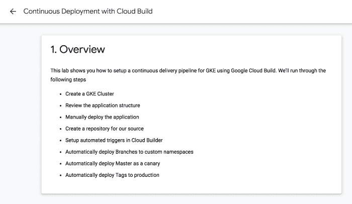
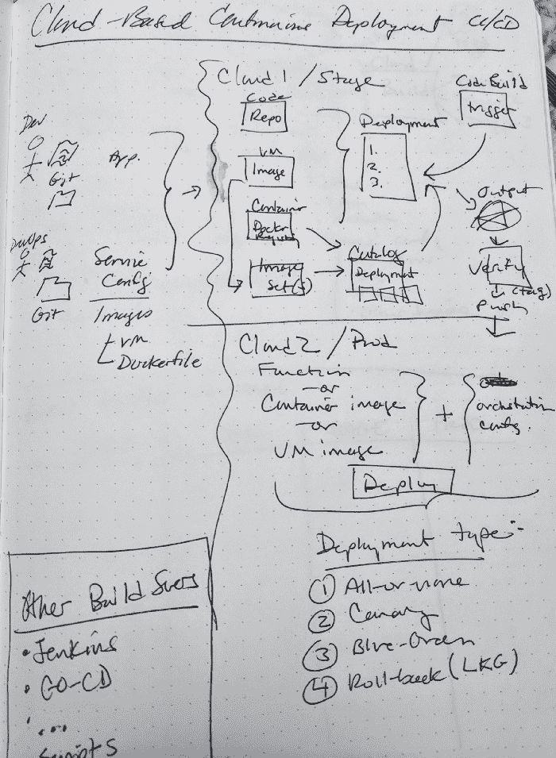
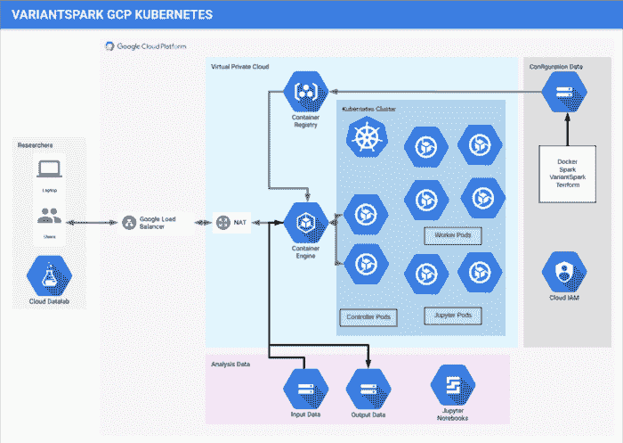
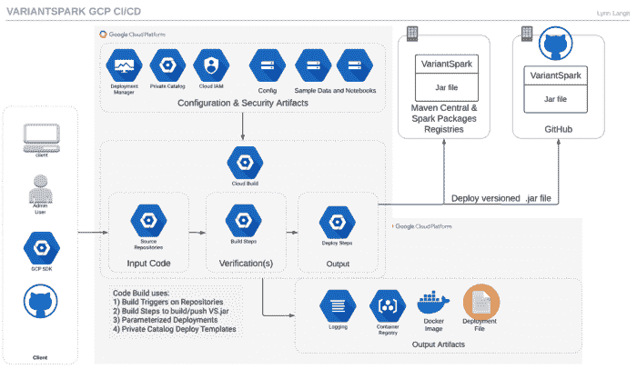

# GCP 基于云的 CI/CD |云专家

> 原文：<https://acloudguru.com/blog/engineering/cloud-based-ci-cd-on-gcp>

几年前，我和一个团队一起为一个 AWS 项目建立了一个生产 [CI/CD 管道](https://acloudguru.com/course/implementing-a-full-ci-cd-pipeline)。当时，没有一个主要的云供应商提供他们自己的 CI/CD 服务，所以我们使用了开源的 [GO CD 服务器](https://www.gocd.org/)。

虽然我们成功了，但这个项目很乏味，花了几个月的时间。出于这个原因，我一直对尝试集成替代方案感兴趣。

最近，我的大部分生产工作都涉及到为生物信息学研究大规模构建和测试基于云的数据管道。我一直在思考如何最好地利用新的基于云的 CI/CD 服务来自动化这些复杂的管道部署。

### 描绘自动化部署

当我今天看完一篇写得很好的关于 GCP CI/CD 的教程时，我惊讶地发现我找不到任何关于这个过程的图表。虽然我成功地完成了教程，但我仍然觉得我没有完全理解解决方案架构应用程序。

GCP cloud-native CI/CD Tutorial Steps

接下来，我试图画出我在教程中完成的自己的版本。从我的生产经验中快速勾画出考虑事项，并试图将它与我从完成教程中学到的东西结合起来，这并不令人满意。结果如下所示。

My initial thoughts around cloud-native CI/CD

对我来说，通过复杂的步骤找到一条清晰的路径还不是很明显。画完草图后，我试着思考构建这种管道所涉及的每个服务(T1)或服务(T3)的集合(T2)。

### 考虑 GCP 服务

首先，我试图了解 GCP 工具服务产品，以及每项服务与为我的团队正在构建的数据管道类型构建 CI/CD 解决方案的关系。

有许多工具。以下是我对“工具”菜单上列出的每一项 GCP 服务的理解。请注意，所有这些服务都是无服务器的。

GCP Tools

### 了解更多信息

然后我看了一些最近的 [GCP:下一个](https://www.youtube.com/user/googlecloudplatform/playlists?view=50&flow=grid&shelf_id=26)会议的演示。对我最有用的是以下内容:

1.  “[跨多个环境的 CI CD 很有趣，但展示了将非 GCP 工具(詹金斯、](https://www.youtube.com/watch?v=rt287-94Pq4)[哈希公司保险库](https://acloudguru.com/course/hashicorp-vault) …)与 GCP 工具相结合，因此给潜在场景增加了更多复杂性。
2.  “[通过云构建在 K8 上更快地开发](https://www.youtube.com/watch?v=TYx0BTyFtmc)”—K8[ska ffold](https://skaffold.dev/)库的引人注目的演示，但没有展示端到端场景。
3.  "[使用 GCP 工具开发、部署&调试](https://www.youtube.com/watch?v=yP9a5gDRUqY) " —最有用的是演示如何使用各种服务的演示，例如非常智能的[在源代码库中搜索](https://cloud.google.com/source-repositories/docs/searching-code)。

尽管这些演示和做教程有助于我理解如何为我的客户使用这些服务，但我仍然无法想象我实际上会构建什么。为此，我尝试为一个用例绘制一个可能的 CI/CD 架构，这个用例我已经工作了一段时间。

### 可视化 GCP 数据管道的 CI/CD

下面是我为我的一个客户设计解决方案的尝试。我将首先描述应用程序架构。用例是通过专门的基因组学机器学习库进行生物信息学研究， [VariantSpark](https://bioinformatics.csiro.au/variantspark) 。

下图是 GCP K8 公司的解决方案架构:

CSIRO’s VariantSpark on GCP K8

您会注意到这是一个数据湖，K8 集群处理来自 GCS 的数据。托管 Jupyter 笔记本电脑是解决方案的一部分，因为这是研究工作的首选环境。

下面显示的是我的第一份草案，我想象我的团队如何使用 GCP CI/CD 服务来建立一个管道，以在 GCP 部署 VariantSpark K8 集群。

GCP CI/CD Pipeline for VariantSpark K8 Deployment

因为 VariantSpark 是开源库中的一员，所以它会不断得到改进。然而，因为 VariantSpark 是一个研究工具，所以它在发布时使用主版本号和次版本号，以便可以在可重复的生物信息学研究论文中引用。

因此构建集群的过程首先需要确定基本容器映像需要哪个版本的 VariantSpark JAR 文件。管道可能需要对 VariantSpark 的源 GitHub Repo 执行 maven 构建。

> 云构建构件包括 Docker 映像、Kubernetes 集群等等

GCP [源代码库可以镜像 GitHub Repos](https://cloud.google.com/source-repositories/docs/mirroring-a-github-repository) 。云构建可以使用源存储库上的触发器来触发构建。云构建包括各种类型映像的构建器(任务)，包括 [maven](https://cloud.google.com/cloud-build/docs/cloud-builders) 。云构建器还包括 docker 和 kubectl，因此 VariantSpark JAR 文件可以作为 docker 映像的一部分构建，该映像可以用于生成一个 [GKE](https://acloudguru.com/course/google-kubernetes-engine-gke-beginner-to-pro) 集群。

此外，[Google Deployment manager](https://cloud.google.com/deployment-manager/docs/fundamentals)可以服务于 YAML 部署，该部署详细描述了 GKE 集群所需的其他 [GCP 服务配置](https://cloud.google.com/deployment-manager/docs/fundamentals)。似乎也可以使用 [GCP 私人目录](https://cloud.google.com/private-catalog/docs/overview)为拥有 GCP 组织账户的研究小组提供 VariantSpark GKE 部署模板。

### 后续步骤

现在我已经了解了这些服务的基础，我期待着与世界各地的研究和开发团队合作，为生物信息学建立无服务器 CI/CD 管道。

* * *

Lynn Langit 是大数据和云架构师、谷歌云开发专家、AWS 社区英雄和微软数据平台 MVP。