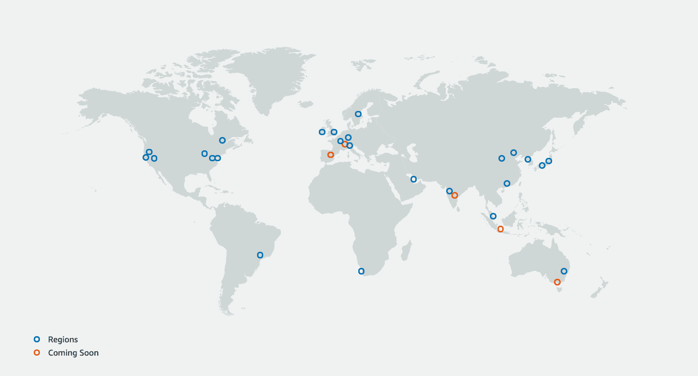
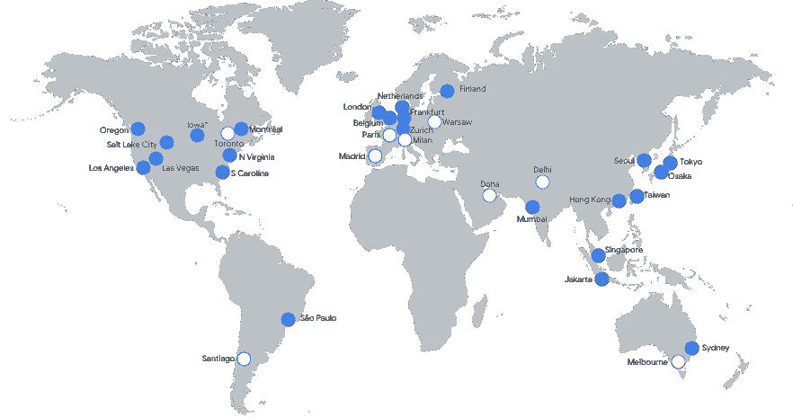

# 云比较:AWS EC2 vs Azure 虚拟机 vs Google 计算引擎|云专家

> 原文：<https://acloudguru.com/blog/engineering/cloud-comparison-aws-ec2-vs-azure-virtual-machines-vs-google-compute-engine>

### TL；博士:

尽管新的和创新的云技术激增，但云中托管的良好的旧虚拟机(VM)仍然是最受欢迎的服务之一，并且通常负责最大份额的云支出。

虚拟机通常被称为“实例”，用于广泛的场景:从 web 和应用服务器到高度专业化的工作负载，如机器学习和分析。简而言之，虚拟机是我们现代生活方方面面的发动机。

这引发了主要云提供商之间的激烈竞争，以获得竞争优势。本文将比较亚马逊网络服务(AWS)、微软 Azure 和谷歌云平台(GCP)的虚拟机服务，并提供一些关于现代公共云最受欢迎的方面的见解。

### 背景

对于大多数读者来说，坐在壁橱里运行单一应用程序(如电子邮件或虚拟主机)的物理服务器的概念要么是遥远的痛苦记忆，要么是他们从老同事那里听到的故事。从历史上看，这是大多数组织的运作方式，较大的组织依赖于装有空调的服务器机房，而不是壁橱。

21 世纪初虚拟化的采用改变了游戏规则。它使应用程序更具可移植性，与硬件更少纠缠:管理员现在不是在专用的物理服务器上托管应用程序，而是在“虚拟服务器”上托管它们，通常是在别人的硬件上。

这为现代公共云铺平了道路，公共云主要是为了满足托管虚拟机的需求而发展起来的，今天仍在继续为这一目的服务，尽管增加了一些附加功能。

从表面上看，云虚拟机相当于本地虚拟机，就像您将与 VMware 或 Hyper-V 一起部署的虚拟机一样。但是现代云虚拟机提供的功能远远超过了过去的虚拟机，本文将探讨其中的一些功能，以及三大云提供商是如何脱颖而出的。

下表简要总结了 AWS、Azure 和 GCP 提供的虚拟机服务:

| 服务 | GA 自 | 区域可用性 |
| --- | --- | --- |
| AWS EC2 | 2006 年 8 月 | 全球的 |
| Azure 虚拟机 | 2012 年 6 月 | 全球的 |
| 谷歌计算引擎 | 2013 年 4 月 | 全球的 |

## 定价

由于所涉及的复杂性和变量，比较云提供商之间的虚拟机价格很可能是一篇 MBA 论文。更实际的方法是检查一个常见的用例，可以说是“比较苹果和苹果”。

让我们考虑下面两个常见的场景。

请注意，我们将只关注虚拟机的每月成本(vCPUs、内存和存储)，但在生产环境中，总成本中还有许多其他因素，如数据传输、软件许可等。

### 场景 1:一个按需虚拟机

下表比较了用作 web 服务器、运行 Linux 的一般用途虚拟机的按需(即付即用)月成本:

| **供应商** | **虚拟机类型** | **vcpu** | **内存** | **存储** | **每月总费用** |
| 自动警报系统 | T4g.xlarge | 四 | 16 GB | 32 GB 固态硬盘 | $101 |
| 蔚蓝的 | Bs 系列 | 四 | 16 GB | 32 GB 固态硬盘 | $121 |
| GCP | E2 | 四 | 16 GB | 32 GB SSD | $99 |

### 场景 2:五台计算优化的保留虚拟机

下表比较了运行 Linux 的五个计算优化实例(保留期为 3 年)的每月成本:

| **供应商** | **虚拟机类型** | **vcpu** | **内存** | **附属存储器** | **预订期限** | **每月总费用** |
| 自动警报系统 | C5a.4xlarge | 16 | 32 GB | 128 GB 标准 | 3 年 | $1,002 |
| 蔚蓝的 | F16s v2 | 16 | 32 GB | 128 GB 标准 | 3 年 | $905 |
| GCP | c2 标准 16 | 16 | 64 GB | 128 GB 标准 | 3 年 | $1,243 |

如前所述，许多变量都会影响价格。这里介绍的这两种情况只是示例，总月成本是使用每个提供商的定价计算器获得的。

* * *

**[云迁移:角色扮演游戏](https://get.acloudguru.com/cloud-migration-role-playing-game-webinar)** 云迁移活动需要策略和知识——有点像龙与地下城&的游戏。加入[这一独特的角色扮演练习](https://get.acloudguru.com/cloud-migration-role-playing-game-webinar)，专家们将通过真实的云迁移场景进行游戏。

* * *

## 功能比较

对于大多数用例来说，三个主要提供商的产品非常相似，但是也有一些不同，特别是在集成服务和工具方面。

由于每个提供商都围绕各自的虚拟机服务提供了大量的功能，因此我们将重点关注一些最感兴趣的功能。

### 虚拟机类型

你不会试图用剪刀修剪你的草坪，是吗？用电锯切开一个西瓜怎么样？希望你的答案是“不”。有更合适的工具来完成这些任务。

同样，您还需要为正确的作业使用正确的虚拟机类型！

许多应用程序会对一般的虚拟机(通常称为通用虚拟机)感到满意。但是某些特定的应用程序更加挑剔:例如，一个分析应用程序可能需要一个拥有更多计算资源的虚拟机，而一个大型数据库应用程序可能需要一个针对高 I/O 量进行优化的虚拟机。

意识到对多种虚拟机类型的需求，云提供商响应了这一号召。你一定会找到适合几乎所有用例的东西。

下表显示了 AWS、Azure 和 GCP 可用的虚拟机类型:

| **用例** | **AWS EC2** | **Azure 虚拟机** | **GCP 计算引擎** |
| 通用 | A1，M4，M5，M5a，M5n，M5zn，M6g，T2，T3，T3a，T4g，Mac | b、Dsv3、Dv3、Dasv4、Dav4、DSv2、Dv2、Av2、DC、DCv2、Dv4、Dsv4、Ddv4、Ddsv4 | E2，N2，N2D，N1 |
| 计算优化 | C4、C5、C5a、C5n、C6g、Cgn | f、Fs、Fsv2 | C2 |
| 内存优化 | R4，R5，R5a，R5b，R5n，R6g，X1，X1e，高内存，z1d | Esv3、Ev3、Easv4、Eav4、Ev4、Esv4、Edv4、Edsv4、Mv2、M、DSv2、Dv2 | M2 M1 |
| 存储优化 | D2，D3，D3en，H1，I3，I3en | Lsv2 | 不适用的 |
| 加速计算和高性能 | F1，G3，G4ad，G4dn，P2，P3，P4，Inf1 | NC，NCv2，NCv3，NCasT4_v3(预览)，ND，NDv2(预览)，NV，NVv3，NVv4，HB，HBv2，HC，H | 主动脉第二声 |

虽然这个列表肯定会随着时间的推移而变化，但快速浏览一下就会发现，AWS 和 Azure 似乎拥有最多样化的实例类型列表，而 GCP 的选择范围较窄。

对于一般用途的应用，任何一个供应商都可以满足大多数需求。对于更专业的工作负载，AWS 和 Azure 可能更合适。

## 区域可用性

不管我们的星球是如何连接的，信息包只能传播这么快。根据您的用户和客户在世界上的位置，将您的基础设施放置在地理上尽可能靠近他们的地方是有意义的。

这三家供应商都吹嘘他们的全球数据中心网络有多广泛，所以让我们比较一下他们的全球存在。

### 自动警报系统

AWS 拥有 25 个全球区域，每个区域由两个或更多数据中心组成(称为可用性区域)，计划在 2021 年初增加 15 个区域。

*AWS Global Infrastructure Map. Source: aws.amazon.com*

### 蔚蓝的

Azure 目前在全球 33 个地区运营，并计划增加一些地区。

*Microsoft Azure Global Infrastructure Map. Source: azure.microsoft.com*

### GCP

谷歌云在 24 个地区运营，其他地区也在计划中。

*Google Cloud Platform Global Infrastructure Map. Source: cloud.google.com*

这三家供应商都拥有庞大的全球网络，并正在积极扩大其全球业务。就全球业务而言，微软 Azure 似乎比 AWS 略胜一筹，而 GCP 目前在非洲、中东或中国都没有业务。

* * *

[**获得痛苦的云词典**](https://get.acloudguru.com/cloud-dictionary-of-pain)
说云不一定要努力。我们分析了数以百万计的回复，找出了最容易让人犯错的概念。抓住这个[云指南](https://get.acloudguru.com/cloud-dictionary-of-pain)获取一些最痛苦的云术语的简洁定义。

* * *

## 虚拟机扩展

公共云的一大承诺是能够自动扩展或缩减基础架构，同时只需为正在使用的资源付费。公司进行巨额资本投资以适应偶尔出现的需求高峰(如黑色星期五)的日子已经一去不复返了，只是为了在今年剩下的时间里保持闲置！

### AWS 中的虚拟机扩展

在 AWS 中，主要的 VM 扩展服务是 EC2 Auto Scaling，但是也可以使用一个更新的服务，它的通用名称是 [AWS Auto Scaling](https://acloudguru.com/course/designing-high-availability-fault-tolerance-and-dr-with-aws-services) (后者也可以自动扩展其他类型的云资源)。触发器在扩展策略中定义，这些策略应用于称为自动扩展组(ASG)的虚拟机逻辑组。

AWS 中的扩展策略可以从简单到非常精细和复杂。触发器可以基于常见的指标，如 CPU 利用率，但也可以使用其他基于云的指标，如 [CloudWatch](https://acloudguru.com/hands-on-labs/use-cloudwatch-for-resource-monitoring) ，它们提供了非常广泛的指标可供选择。

除了 EC2 自动扩展之外，AWS 自动扩展是一项旨在降低配置扩展策略复杂性的服务。

AWS Auto Scaling 基于用户提供的策略自动构建策略，例如针对成本或可用性(或两者的组合)进行优化。它还提供预测性扩展，这是一种试图预测流量模式并相应扩展基础设施的机器学习方法。

### Azure 中的虚拟机扩展

Azure 的自动缩放方法与 AWS 非常相似。它利用了名为[虚拟机规模集(VMSS)](https://acloudguru.com/hands-on-labs/create-a-load-balanced-vm-scale-set-in-azure) 的服务。VMSS 中的虚拟机作为一个单元进行管理，并且可以在达到某些预定义的阈值时或根据设定的计划进行扩展或缩减。

在 Azure 中，您还可以使用各种指标来触发扩展事件，包括基于主机的指标、应用程序级指标(使用 App Insights 服务)和来宾 VM 指标，但这些都需要安装 Azure 诊断扩展。

Azure 不提供任何预测性扩展。

* * *

*如果你已经使用 Azure 很长时间了，那么你可能会被问到，**“为什么我们的账单这么高？”**要回答这个问题，你需要进一步了解 [Azure 成本管理](https://acloudguru.com/course/cost-control-on-azure)。在考虑成本的情况下改进计划。*

* * *

### GCP 的虚拟机扩展

在 GCP 的计算引擎中，伸缩服务是[托管实例组](https://acloudguru.com/hands-on-labs/creating-a-load-balanced-managed-instance-group-on-google-cloud-platform) (MIGs)的一个特性。因此，虚拟机必须在 MIG 中才能启用自动扩展。

自动缩放策略定义了将触发缩放事件的一个或多个信号。信号可以基于目标利用率指标，如 CPU 利用率、负载平衡能力或 GCP 的云监控指标。信号也可以是基于时间表的，尽管这一特性仍处于预览模式，还没有广泛应用。与 AWS 一样，GCP 也提供基于机器学习算法分析的历史趋势的预测性缩放。

* * *

*设置多台服务器？我们都知道在几台服务器上连续运行命令是乏味且容易出错的。查看我们的动手实验室，学习使用[引导脚本](https://acloudguru.com/hands-on-labs/using-bootstrap-scripts-in-google-compute-engine)在谷歌计算引擎中自动完成新服务器的基本设置。*

* * *

下表总结了每个提供商的虚拟机扩展功能:

| **供应商** | **虚拟机扩展服务** | **组织单位** | **支持来宾虚拟机指标** | **预测缩放** | **预定缩放比例** |
| 自动警报系统 | EC2 自动缩放
AWS 自动缩放 | 自动缩放组(ASG) | 是–需要云监控代理 | 是 | 是 |
| 蔚蓝的 | 虚拟机规模集 | 虚拟机规模集(VMSS) | 是–需要 Azure 诊断扩展 | 不 | 是 |
| GCP | 自动缩放 | 托管实例组(MIG) | 是–需要云监控代理 | 是 | 预览功能 |

## 冬眠

当虚拟机不需要运行时，有哪些省钱的方法？

最常见的解决方案是简单地停止虚拟机，或者在不再需要时终止它。所有这三个提供商都可以让您轻松地将虚拟机从运行状态切换到停止状态，但 AWS 是唯一一个能够通过从 RAM 保存到磁盘来休眠虚拟机的云提供商，然后在虚拟机再次启动时从虚拟机停止的地方恢复，就像台式机和笔记本电脑中的睡眠功能一样。

GCP 有一个类似的功能，但它目前处于预览模式，并不普遍可用。

下表显示了当前对虚拟机休眠的支持:

| **供应商** | **虚拟机休眠** |
| 自动警报系统 | 是 |
| 蔚蓝的 | 不 |
| GCP | 预览功能 |

## 虚拟机许可

以下是今年的轻描淡写:云许可非常复杂。

对虚拟机许可模式的全面探索可能需要企业财务学位，因此我们将关注两个主要的感兴趣的软件供应商:微软和甲骨文。

### 微软许可和云虚拟机

#### 按需

对于像 SQL Server 和 Windows Server 这样的微软产品，所有三个提供商都提供按需许可证，作为运行虚拟机成本的一部分。这是最省事的选择，因为它不需要管理、前期成本或长期投资。不过，这种模式可能不是最具成本效益的选择，尤其是对于那些已经与微软签订了许可协议并希望自带许可证的客户。

#### BYOL

“自带许可证”(BYOL)模式是现有微软客户的一个受欢迎的许可选项。过去，微软 BYOL 许可证要求许可的应用程序托管在专用服务器上，或购买软件保障(SA)的共享服务器上，这基本上是一种升级，给予客户“许可证移动”权利，允许他们在共享服务器上的云虚拟机上使用微软产品。

截至 2019 年 10 月，微软修改了他们的许可模式，现在即使应用程序托管在专用的云服务器上，也需要额外的费用。这些费用适用于所有主要的云提供商，包括 Azure。

在一个经典的情节转折中，微软推出了 [Azure Hybrid Benefit](https://azure.microsoft.com/en-us/pricing/hybrid-benefit/) ，这是一个许可计划，帮助客户大幅降低在 Azure 云中运行微软工作负载的成本。

一句话:鉴于最近的许可变化，运行微软产品的大量虚拟机可能会从 Azure 中受益，而不是 AWS 或 GCP。

### Oracle 虚拟机许可

Oracle 是一种流行的 RDBMS 解决方案，与不同的供应商有复杂的许可协议。虽然提供了多种 Oracle 服务，但在云虚拟机上运行 Oracle 时，适用以下许可模式:

*   AWS: BYOL
*   蔚蓝色:BYOL
*   GCP:不支持

## 计费模型

云计费可能非常复杂，许多公司通过提供服务和解决方案来减少和简化它，从而赚了一大笔钱。虽然关注点通常是按需虚拟机的每小时成本，但也有其他计费模式可以考虑，这些模式可能会显著降低成本。

下表显示了每个提供商提供的虚拟机计费模式，后面是每个模式的简要描述:

| **供应商** | **虚拟机计费模式** |
| 自动警报系统 | 按需
预约
现货
储蓄计划 |
| 蔚蓝的 | 按需
预留
点 |
| GCP | 按需
持续使用
承诺使用
可抢占 |

*   **按需**:最简单最常见的型号。也称为“随用随付”:您在虚拟机运行时付费，无需任何前期成本或投资。对于像 Microsoft Server 或 Oracle 这样的许可软件，许可成本是由提供商计算和管理的。

*   **Spot** :对于具有灵活的停止和开始时间的应用程序，当多余的计算资源可用时，可以根据客户提供的投标价格以很高的折扣(高达按需成本的 90%)购买。

*   **预留**:对于可预测的工作负载，客户可以购买预留容量并承诺一年或三年，从而实现可观的节约(高达 60%的按需成本)。

*   **节约计划**:仅在 AWS 中提供，这种模式类似于保留模式，客户承诺在一年或三年内使用一定数量的产品。

*   **持续使用**:这是一种 GCP 计费模式，类似于 AWS 的储蓄计划，但没有 1 年或 3 年的承诺。客户承诺每月的使用量，并在达到约定的使用量后获得每分钟计费的折扣。

*   **承诺使用** : GCP 版的保留。他们提供 1 年和 3 年的期限。

*   可抢占的 : GCP 版本的 Spot 实例。

## 市场

随着公共云的持续流行，提供商建立了软件市场，供应商可以在那里轻松地向客户提供他们的产品。

这些市场帮助客户简化了他们首选的第三方解决方案的部署:客户可以简单地使用供应商提供的映像并将其部署在他们选择的虚拟机上，而不是下载、安装和配置软件的繁琐过程。

下表给出了每个提供商的市场规模:

| **供应商** | **市场中的供应商数量** |
| 自动警报系统 | ~ 12,000 |
| 蔚蓝的 | ~ 17,000 |
| GCP | ~ 4,000 |

虽然在比较这三家供应商时，市场的规模可能不那么重要，但看看上面的数字就可以清楚地看出 Azure 和 AWS 是目前最大的两个市场。

* * *

**[Ho](https://get.acloudguru.com/cloud-dictionary-of-pain) [w 公司正在转向云计算](https://get.acloudguru.com/road-to-multicloud-report)**
了解随着学习者开始关注 AWS 之外的产品，公司如何为云计算的未来做准备。

* * *

## 底线

在本文中，我们仅仅触及了公共云中可用的虚拟机服务的皮毛。尽管现代创新如[无服务器](https://acloudguru.com/course/serverless-concepts)和托管服务的兴起，云虚拟机将永远是云生态系统的主要支柱。

很明显，三大云提供商都在这一领域投入了大量创新。虽然 AWS 在早期占据主导地位，但 Azure 已经取得了长足的进步，并获得了很大一部分市场份额，而 GCP 是一个规模较小但仍在增长的公司。

**如果您正试图在这三家供应商中做出选择，以下是一些需要考虑的问题:**

*   您的应用程序需要什么类型的实例，对于这种类型的实例，谁提供的价格最有竞争力？
*   云虚拟机通常是客户购买的众多服务之一，那么哪些相关服务对您很重要，哪个提供商提供这些服务呢？(查看我们的细目分类[比较 AWS、Azure 和 Google Cloud IAM 服务](https://acloudguru.com/blog/engineering/comparing-aws-azure-and-google-cloud-iam-services)，看看这是否会影响你选择的云。)
*   您有任何高度专业化的工作负载吗？例如，GCP 为 Kubernetes 提供了优化的实例，其性能可能优于 AWS 和 Azure。
*   需要什么类型的操作系统许可证？微软主导的环境可能会在 Azure 中实现更多的成本节约。
*   如果其他条件相同，您是否与其中一家供应商有现有关系？他们中的一个能提供比其他人更好的交易吗？

当决定哪家提供商赢得 AWS EC2 vs . Azure VMs vs . GCP 计算引擎竞赛时，显而易见的(也是令人讨厌的)答案是:视情况而定！

#### 关于作者

Moneer Rifai 是一名云开发者和架构师，热衷于帮助他人进入这个领域。([LinkedIn](https://www.linkedin.com/in/moneerrifai/)|[Twitter](https://twitter.com/moneerrifai))

* * *

## 提升您的云计算职业生涯

无论您是云新手还是经验丰富的专家，云专家都能让您轻松(而且非常棒)地获得认证并掌握现代技术技能。查看 ACG 目前的[免费课程](https://acloudguru.com/blog/news/whats-free-at-acg)或者现在就开始体验[的免费试用](https://acloudguru.com/pricing)。