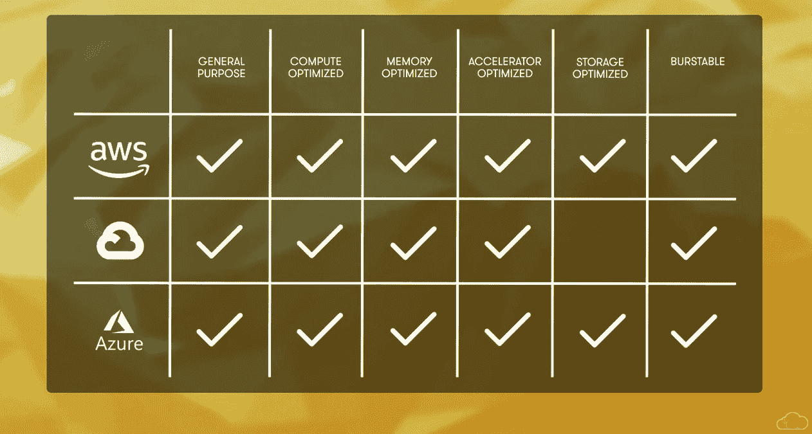
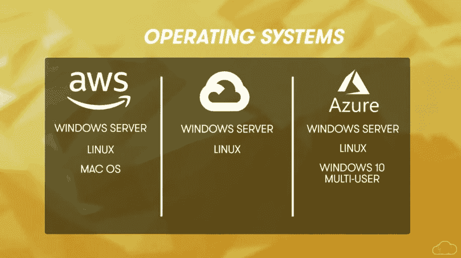

# 计算比较:AWS vs Azure vs GCP |云专家

> 原文：<https://acloudguru.com/blog/engineering/compute-compared-aws-vs-azure-vs-gcp>

在这篇文章中，我们的[云提供商比较系列](https://acloudguru.com/videos/cloud-provider-comparisons)的一部分，我们将帮助涵盖 AWS、Azure 和 GCP 提供的云计算选项的相似之处和不同之处。

* * *

**通往更好职业的钥匙**

[立即开始 ACG](https://acloudguru.com/pricing) 通过 AWS、Microsoft Azure、Google Cloud 等领域的课程和实际动手实验室来改变你的职业生涯。

* * *

## 什么是计算机？

计算通常是组织为开始云计算而部署的第一批资源之一。在这篇文章中，我们研究了亚马逊网络服务(AWS)、微软 Azure 和谷歌云平台(GCP)的可用计算选项。

如果你在 IT 行业工作过一段时间，你可能对服务器很熟悉。多年来，它们已经从独立的白盒发展到耗电的超高密度计算机堆，可以使房间比太阳还热(如果冷却不当)。

随着时间的推移，我们在硬件上虚拟化了操作系统，以提高服务器密度并更好地利用硬件。

自然的发展是将这些服务器迁移到云中，消除管理电源、冷却和服务器硬件附带的所有任务的需要，从而解放 IT 专业人员，让他们从事为组织增加价值的重要工作。还有看猫咪视频。

如果你想了解 Azure、亚马逊网络服务和谷歌云平台是如何实现这些计算资源的，请继续阅读！

计算机入门

在我们开始比较之前，让我们先快速了解一下平台即服务(PaaS)和基础架构即服务(IaaS)。了解这一点很重要，因为对于在云中部署服务的这两个选项，管理责任是不同的。

## IaaS 服务的一个例子是将 web 服务器部署到云提供商来托管网站，而将网站部署到托管的 web 服务是使用 PaaS 服务的一个例子。

分担责任模式

共享责任模型概述了谁负责管理云中部署的服务的不同方面。例如，在 Azure 上部署 IaaS 服务器时，组织不必担心物理服务器和虚拟化软件，但是，操作系统补丁和软件更新仍然是持续管理的一部分。

## 在谈论云计算和云服务时，理解这一点很重要，因为在大多数情况下，计算是一种 IaaS 服务，大部分管理责任落在客户身上。

计算选项

IaaS 计算的核心是所提供的虚拟机大小，具体的大小和功能会随着每个提供商的不同而不断变化。

## AWS 有弹性云计算或 EC2。

GCP 称他们的服务为计算引擎。

*   Azure 有虚拟机来提供计算资源，类似于我们都喜欢的本地虚拟机。
*   接下来，我们将探讨每种产品的大小和性能选项，以及每家提供商的操作系统、可用性和可扩展性以及一些成本节约选项。
*   让我们从概述每种产品的性能选项开始。

自动警报系统

Amazon EC2 为常见工作负载提供了通用虚拟机，为需要高性能处理的应用程序提供了计算优化类型，为受益于大量内存的应用程序(如在内存中处理数据的应用程序)提供了内存优化选项。

### AWS 还为硬件加速处理提供了加速计算选项，利用 GPU 和存储优化选项处理需要对数据集进行高顺序读写访问的工作负载。

*   此外，它还支持突发性能实例，这对于具有较低基准 CPU 使用率的应用程序来说是一个经济高效的选择。
*   谷歌云
*   GCP 计算引擎还支持通用虚拟机和计算优化，可为每个 CPU 内核提供高性能。

### 有一个内存优化选项和加速虚拟机，就像 AWS 一样，还有一个共享核心或可突发虚拟机选项。

*   在发布时，GCP 没有提供存储优化选项。
*   微软 Azure
*   就像其他人一样，Azure compute 提供了类似的通用虚拟机以及计算和内存优化虚拟机。加速器优化的虚拟机称为 GPU 类型。

### Azure 提供了一个存储优化的虚拟机，以及针对不需要一致访问 CPU 的工作负载的突发选项。

*   支持的操作系统
*   让我们来看看每个提供商提供的不同类型的操作系统。不同的云提供商支持的操作系统略有不同。这三家公司都为 Windows 和 Linux 发行版的多个版本提供了现成的映像。

## 此外，AWS 提供 Mac OS。在 Azure 中，支持 Windows 10 的多用户版本，被恰当地称为 Windows 10 多用户。

Let’s move on the different types of operating systems available with each provider. The supported operating systems differ slightly between cloud providers. All three offer ready to use images for multiple versions of Windows and Linux distributions.

所有供应商都为各种各样的 Linux 发行版提供映像。一些提供商提供他们自己风格的 Linux，比如 AWS 和 Amazon Linux。具体的发行版本因提供商而异。

保持服务的可用性非常重要，在云中运行服务在服务部署的方式和位置方面提供了更大的灵活性。接下来让我们看看可用性和可伸缩性的选项。

可用性和可扩展性

每个云提供商跨地区分配工作负载。作为一个或多个数据中心分组的区域。如果一个区域出现故障，跨区域分布工作负载可以提供高可用性。

## 每个区域被分成多个独立但连接良好的区域。请将这些视为位于同一城市的独立数据中心。它们在 GCP 被称为“区域”，在 Azure 和 AWS 被称为“可用区域”。

规划云中的计算服务时，区域和分区非常重要，原因有二。

首先，它们提供高可用性。如果工作负载分布在多个地区和区域，应用程序或服务在某个地区或区域出现故障时具有弹性。

区域还允许我们将工作负载放在离客户更近的地方。延迟是影响应用程序性能的一个因素。在我们能够改变物理定律之前，在云中部署计算和其他服务时，物理位置将是一个考虑因素。

*   Azure、GCP 和 AWS 都提供多个地区和区域，但不是每个地区都支持每种类型的虚拟机。一些应用程序，如[机器学习](https://acloudguru.com/blog/engineering/what-is-machine-learning-as-a-service-mlaas)或季节性订单处理，受益于随着负载的增加而动态增加虚拟机的数量。
*   在需要时向资源池动态添加更多节点并在不使用时取消分配这些节点的能力按需提供容量，同时在不需要资源时降低成本。

自动警报系统

对于这种类型的工作负载，Amazon EC2 提供了自动扩展功能，允许 EC2 实例的数量随着需求的增加而自动扩展，当需求减少时，这些实例的数量会自动缩减。这可以根据 CPU 利用率等指标来完成。

### EC2 还提供了一个称为机群管理的特性，它通过自动替换不健康或不可用的实例，将自动伸缩扩展到维护可用性。

*   此外，预测性扩展使用机器学习来根据使用模式预测和添加容量。
*   自动扩展在多个区域中可用，在 AWS 中称为“可用区域”。
*   谷歌云
*   GCP 有称为“托管实例组”或“MIG”的虚拟机组。MIG 可以作为单个实体进行管理。它支持自动扩展，根据负载增加或减少虚拟机实例的数量。扩展策略由 CPU 利用率、容量或负载平衡器或自定义指标设置。

### 基于计划的自动扩展也是一个选项，GCP 可在已知工作负载增加时增加容量。

*   另一个称为自动修复的选项可以重新创建未通过运行状况检查的虚拟机。
*   托管实例组可以部署到单个区域，也可以跨同一区域的多个区域部署。
*   微软 Azure
*   Azure 和其他虚拟机一样，提供了一个由相同虚拟机组成的集中管理的池，称为“规模集”。

### 通过基于虚拟机利用率的自动扩展策略，一个扩展集的虚拟机数量可以自动增加和减少。自动扩展计划可以根据预期的高利用率时间进行扩展和缩减。自动实例修复选项可以修复比例集中不可用的失败实例。

*   规模集可以部署在 Azure 的可用性区域中，以实现跨区域的高可用性。
*   批准
*   我们谈了很多硬件，但是软件呢？让我们继续讨论许可虚拟机上运行的操作系统的选项。

## 使用开源 Linux 服务器，您只需为使用操作系统的虚拟硬件付费。

对于 Windows 操作系统，可以选择为服务器操作系统和硬件付费。这使得 Windows 虚拟机的成本高于可比的 Linux 虚拟机。然而，将许可证附加到虚拟机的优点是虚拟机符合微软许可。

*   拥有 Microsoft 批量许可和有效软件保障合同的组织可能有资格获得混合使用权益。这是一个自带许可证选项，将现有的 Microsoft 批量许可混合使用优势应用于虚拟机。虚拟机的价格与 Linux 虚拟机的价格相当。
*   [**看点:解决“没有经验”的云招聘问题**](https://get.acloudguru.com/solving-no-experience-cloud-problem-webinar)
    没有工作是得不到经验的。但是谁会雇佣没有经验的你呢？谜题！[观看这一免费的点播网络研讨会](https://get.acloudguru.com/solving-no-experience-cloud-problem-webinar)，进行关于云计算职业发展的小组讨论，并获得您的第一份云计算工作。

费用

* * *

Windows 和 Linux 虚拟机还有其他省钱的选择。对于在给定时间内运行虚拟机的某些承诺，每个提供商都有办法降低虚拟机的成本。

* * *

## 对于 GCP，承诺使用折扣提供高达现收现付价格 70%的折扣，以及一年或三年的承诺使用折扣。

AWS 和 Azure 都有一个类似的选项，叫做保留实例。保留实例对承诺一年或三年服务的虚拟机价格进行折扣。

*   Azure、AWS 和 GCP 的另一类虚拟机提供了很高的折扣，在某些情况下高达 90%，但有一个条件。当提供商需要额外服务的容量时，可以随时关闭它们。对于无状态和容错的应用程序来说，这是一个很好的选择，这些应用程序可以在资源重新联机后被中断和恢复，或者在不需要生产环境可用性的开发测试环境中。
*   在 GCP，这些被称为可抢占的虚拟机实例。
*   在 AWS 和 Azure 中，这些被称为 spot 实例。
    *   对于不需要持续访问 CPU 的应用程序，还有另一种选择。这些虚拟机类型适用于偶尔会有突发活动的空闲工作负载。
    *   在 GCP，这些被称为共享核心虚拟机。共享核心虚拟机在物理处理器上使用时间片，并允许短时间内的条件突发。

Azure B 系列和 AWS T 实例具有类似的功能。它们提供基准 CPU 周期，虚拟机在低利用率期间建立信用。然后，该信用可用于高 CPU 使用率时期。基准和信用量取决于虚拟机系列的具体规模。

*   有时，您甚至不需要虚拟机全天候可用。例如，开发和测试环境或者只是偶尔运行的批处理。这三个提供者都可以选择停止和终止正在运行的虚拟机。这将从服务中取消分配虚拟机，并停止相关收费。其他相关费用，如光盘存储仍然适用。
*   AWS 和 GCP 都提供了另一种选择:暂停正在运行的 VM 的能力，在 AWS 中称为“休眠”,在 GCP 称为“挂起”。该选项暂停虚拟机，保留内存状态和相关设置，如 IP 地址，有点像合上笔记本电脑的盖子。

这三家提供商都提供了各种各样的虚拟机大小和选项，以满足任何项目的需求。除了大小，还有保留实例、共享和可突发 CPU 以及自带许可的成本节约选项。

寻找关于在云中运行应用程序的更多信息？[开始免费试用](https://acloudguru.com/pricing)或查看[本月的免费云培训](https://acloudguru.com/blog/news/whats-free-at-acg)。你也可以[在 YouTube 上订阅一位云专家](https://www.youtube.com/c/AcloudGuru/?sub_confirmation=1)的每周云新闻，像我们一样关注[脸书](https://www.facebook.com/acloudguru)，在 [Twitter](https://twitter.com/acloudguru) 上关注我们，并加入 [Discord](http://discord.gg/acloudguru) 上的对话。

All three providers offer a wide variety of VM sizes and options to fit the needs of any project. Along with the size, there’s also cost-savings options with reserved instances, shared and burstable CPUs, and bring your own licensing.

* * *

Looking for more information on running applications in the cloud? [Start a free trial](https://acloudguru.com/pricing) or check out [this month’s free cloud training](https://acloudguru.com/blog/news/whats-free-at-acg). You can also [subscribe to A Cloud Guru](https://www.youtube.com/c/AcloudGuru/?sub_confirmation=1) on YouTube for weekly cloud news, like us on [Facebook](https://www.facebook.com/acloudguru), follow us on [Twitter](https://twitter.com/acloudguru), and join the conversation on [Discord](http://discord.gg/acloudguru).