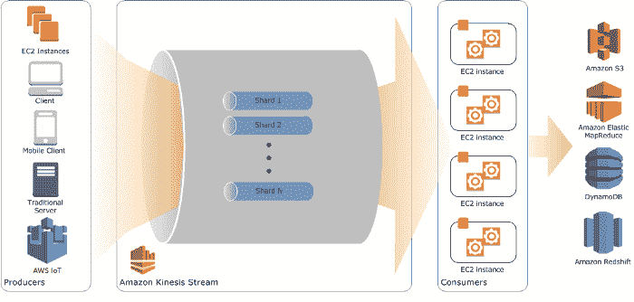
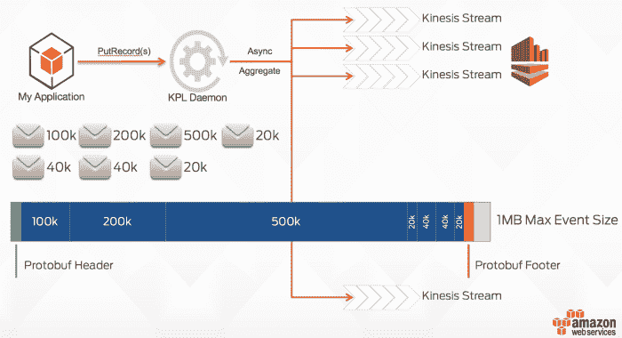
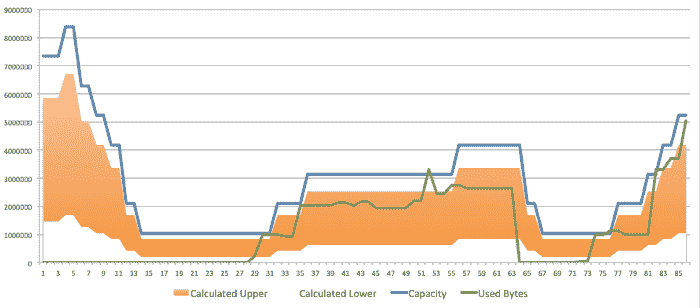

# 深度潜水:亚马逊 Kinesis 大规模流|云专家

> 原文：<https://acloudguru.com/blog/engineering/deep-dive-into-aws-kinesis-at-scale>

使用 Amazon Kinesis 流每月在 AWS 上处理超过 2000 亿条记录时发现的最佳实践

在 [ironSource](http://ironsrc.com/) 建立了每月处理超过 2000 亿条记录的关键任务数据生产管道后，我们想分享一些用鲜血写成的规则。

The data pipeline architecture using Kinesis Streams

* * *

### 亚马逊 Kinesis 流概述

Kinesis 是一个无限可扩展的流，即由碎片组成的服务。该服务因其易用性和低开销以及有竞争力的价格而被广泛使用。这是 Kinesis Streams 和 Kafka 之间的一个共同区别。

像任何托管服务一样，亚马逊 Kinesis 有一些你应该熟悉的限制，以及如何通过扩展和节流来克服这些限制。明智的做法是利用 AWS 提供的生产者、消费者和可用工具来利用这些最佳实践。

Kinesis Streams diagram showing the use of shards within a stream

* * *

### 通过亚马逊 Kinesis 生产者库( [KPL](https://github.com/awslabs/amazon-kinesis-producer) )降低成本

在大范围内，一旦投入生产，就很难改变体系结构，成本成为一个非常大的问题。该服务按 25kb 有效负载单位计费，因此如果您有较小的记录，则聚合消息是有意义的。

当向你的 Kinesis 流发送数据时，你应该将几条消息压缩并聚合成一条，以降低成本。

[亚马逊 Kinesis 生产者库](https://github.com/awslabs/amazon-kinesis-producer) (KPL) [聚集](https://github.com/awslabs/amazon-kinesis-producer/blob/master/aggregation-format.md)并压缩(使用[协议缓冲区](https://developers.google.com/protocol-buffers/))多个逻辑用户记录到单个亚马逊 Kinesis 记录中，以便高效地输入流。该库由 AWS 用 C++构建，并且(仅)具有 Java 绑定。Golang 中有一个开源版本。

KPL explained showing how messages are being aggregated using Protocol Buffers

* * *

### 使用 Kinesis 客户端库( [KCL](http://docs.aws.amazon.com/streams/latest/dev/developing-consumers-with-kcl.html) )

KCL 库由 AWS 编写，支持 KPL 用户记录的自动解聚集。KCL 负责许多与分布式计算相关的复杂任务——例如跨多个实例的负载平衡、对实例故障做出响应、对已处理的记录进行检查点操作，以及对重共享做出反应。

KCL 库在{ [Java](http://docs.aws.amazon.com/streams/latest/dev/kinesis-record-processor-implementation-app-java.html) 、 [Node.js](http://docs.aws.amazon.com/streams/latest/dev/kinesis-record-processor-implementation-app-nodejs.html) 、[中提供了以下语言绑定。NET](http://docs.aws.amazon.com/streams/latest/dev/kinesis-record-processor-implementation-app-dotnet.html) ， [Python](http://docs.aws.amazon.com/streams/latest/dev/kinesis-record-processor-implementation-app-py.html) ， [Ruby](http://docs.aws.amazon.com/streams/latest/dev/kinesis-record-processor-implementation-app-ruby.html) }。

* * *

### 处理方法—按需/定点实例/ Lambda

虽然可以使用按需实例来处理 Kinesis 流，但是强烈建议利用 [AWS spot-instances](https://aws.amazon.com/ec2/spot/) 来处理您的流——这是最具成本效益的方法。

还有一种处理数据的方法是使用带有 Kinesis 的 [AWS Lambda，以及用于 AWS Lambda](https://acloudguru.com/blog/engineering/auto-scaling-kinesis-streams-with-aws-lambda) 的 [Kinesis 记录聚合&解聚合模块。将 Kinesis 流连接到 Lambda 函数是非常容易的——但是您必须考虑成本，看看它对您的特定用例是否有意义。](https://github.com/awslabs/kinesis-aggregation)

* * *

### 想要提升您的云技能吗？

一位云专家提供了一个关于云的所有内容的庞大图书馆，包括:课程、实验室、学习路径等等！

* * *

### 监控室壁运动流

在使用 CloudWatch 监控你的 Kinesis 流时，有两组指标你应该考虑:

1.  基本流级别指标
2.  增强的碎片级指标

对于**流级别度量**，在 [GetRecords 上设置一个警报是一个很好的实践。iteratoragemillissues](http://docs.aws.amazon.com/streams/latest/dev/monitoring-with-cloudwatch.html)了解你的员工是否在流程上落后。

然而，有时可能会有一个特定的工作者/碎片不同步——但是这种状态不会通过全局 IteratorAgeMilliseconds 平均值反映在流级别上。为了克服这一点，我建议每分钟运行一次 Lambda 脚本，并在**碎片级**查询它的 IteratorAgeMilliseconds，如果需要的话发出警报。

### **亚马逊 Kinesis 流指标**

AWS 建议监控以下指标:

**获取记录。IteratorAgeMilliseconds** 跟踪流中所有碎片和消费者的读取位置。请注意，如果迭代器的年龄超过了保留期的 50%(默认为 24 小时，可配置为 7 天)，则存在因记录过期而丢失数据的风险。AWS 建议在*最大值*统计上使用 CloudWatch 警报，在这种损失成为风险之前提醒您。关于使用该指标的示例场景，请参见[落后于](http://docs.aws.amazon.com/streams/latest/dev/troubleshooting-consumers.html#record-processing-falls-behind)的消费者记录处理。

**readprovisionedthroughputexceed** 当您的消费端记录处理落后时，有时很难知道瓶颈在哪里。使用此指标来确定您的读取是否因超过读取吞吐量限制而受到限制。该指标最常用的统计数据是*平均值*。

**writeprovisionedthroughputexceed** 这与`ReadProvisionedThroughputExceeded`指标的目的相同，但用于流的生产者(put)端。该指标最常用的统计数据是*平均值*。

**腐索。成功，腐败记录。成功** AWS 建议在*平均值*统计上使用 CloudWatch 警报来指示记录是否未能流入数据流。选择一种或两种看跌期权类型，具体取决于您的生产商使用什么。如果使用 Kinesis Producer 库(KPL)，使用`PutRecords.Success`。

**获取记录。成功** AWS 建议在*平均*统计上使用 CloudWatch 警报来指示记录是否从流中失败。

* * *

### 节流运动流

如果你把它推到极限，Kinesis 将开始节流你的请求，你将不得不重新分割你的流。节流可能有几个原因。例如，您可能在每个分片上每秒发送超过 1 MB 的有效负载/ 1，000 条记录。但是您可能会遇到由 **DynamoDB** 限制引起的节流问题。

正如在[跟踪 Amazon Kinesis 流应用程序状态](http://docs.aws.amazon.com/streams/latest/dev/kinesis-record-processor-ddb.html)中提到的，KCL 使用 Amazon DynamoDB 表跟踪流中的碎片。当由于重新分片而创建新的分片时，KCL 会发现新的分片，并在表中填充新的行。工人自动发现新碎片，并创建处理器来处理来自它们的数据。KCL 还将流中的碎片分配给所有可用的工作线程和记录处理器。**确保 DynamoDB 表中有足够的读/写容量。**

* * *

### *重新分割 Kinesis 流*

当重新分割一个流时，当它是 2 的倍数或一半时，缩放要快得多。您可以使用 [UpdateShardCount API](http://docs.aws.amazon.com/kinesis/latest/APIReference/API_UpdateShardCount.html) 对您的流进行重新分片。注意，这个 API 不支持缩放超过 200 个片段的流。否则，你可以使用[亚马逊 Kinesis 缩放工具](https://github.com/awslabs/amazon-kinesis-scaling-utils)。

用数百个碎片重新分割一个流可能需要时间。另一种方法是启动另一个具有所需容量的流，然后将所有流量重定向到新流。

An example of re-sharding a Kinesis Streams

* * *

### AWS Kinesis 资源

***开发 Kinesis 的生产者&消费者***

***监控身势***

*   [亚马逊 Kinesis 生产者库](http://docs.aws.amazon.com/streams/latest/dev/monitoring-with-kpl.html) —流生产者库(KPL)提供每个分片、工人和 KPL 应用的指标。
*   [CloudWatch 指标](http://docs.aws.amazon.com/streams/latest/dev/monitoring-with-cloudwatch.html) — Streams 向 Amazon CloudWatch 发送自定义指标，并对每个流进行详细监控。
*   [亚马逊 Kinesis 代理](http://docs.aws.amazon.com/streams/latest/dev/agent-health.html) —亚马逊 Kinesis 代理发布定制的 CloudWatch 指标，以帮助评估代理是否按预期工作。
*   [API 日志](http://docs.aws.amazon.com/streams/latest/dev/logging-using-cloudtrail.html) — Streams 使用 AWS CloudTrail 来记录 API 调用，并将数据存储在亚马逊 S3 桶中。

***故障排除***

#### 查看更多 AWS Kineses

* * *

[*希蒙·托尔茨*](https://www.linkedin.com/in/tolts/) *是*[*Co delorate . io*](http://codelaborate.io/)*的联合创始人兼 CTO，是一位* [*AWS 社区英雄*](https://aws.amazon.com/heroes/europe/shimon-tolts/) *。感谢阅读！*