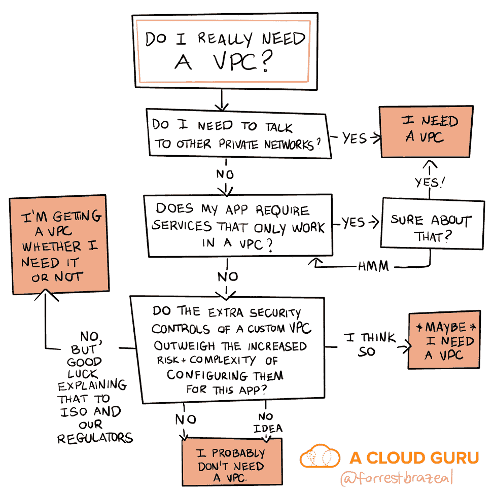

# 我真的需要 VPC 吗？|云专家

> 原文：<https://acloudguru.com/blog/engineering/do-i-really-need-a-vpc>

从安全的角度来看，VPC 并不是一种魔力。这是另一层责任。

在 AWS 上运行应用程序？你需要一个 [VPC](https://docs.aws.amazon.com/vpc/latest/userguide/what-is-amazon-vpc.html) :一个虚拟专用网络，让你的服务器免受公共互联网的破坏，就像它们在你的旧数据中心一样。

或者说，当 EC2 为王时，我们称之为云 1.0 的指导思想是 IaaS 浪潮。

但是这些天，当我在云中构建新的应用程序或者与其他做同样事情的构建者交谈时，VPC 并不总是参与对话。

这是因为云原生应用越来越多地运行在更高级别的托管服务上，如 Lambda、API Gateway 和 DynamoDB，它们通过 API 相互通信。在 AWS 中，这可能意味着使用 [IAM](https://aws.amazon.com/iam/) 进行身份验证和授权来保护微服务之间的交互。

如果您需要连接回遗留数据中心，VPCs 将永远占据主导地位。但是，他们是否仍然应该在保护现代的、诞生在云中的应用程序方面发挥重要作用呢？我有自己的看法，但我决定向一些专家求证。

#### 复选框还是必备？

也许你已经参加了安全团队的会议，试图使用为本地应用开发的清单来评估云原生设计。紫盒安保公司的尼哈特·居文也是。“安全和合规领域正在迎头赶上，”他说。“在合规性方面，更多的是遵循标准和勾选方框”，而不是真正考虑 VPC 可能提供或可能不提供的真正安全优势。

AWS 的另一位英雄、即将出版的新书《[面向高管的云安全](https://medium.com/cloud-security)》的作者 Teri Radichel 也认为 VPC 并不神奇。“VPC 什么都不做，真的，”她指出。“你需要一个适当的网络架构，包括 NACLs、子网和安全组。您需要知道如何构建架构，以便能够监控攻击。人们需要了解网络层、攻击以及攻击者如何在网络中穿梭。”

这就把我们带到了问题的关键:为一个功能正常的应用程序添加 VPC 的争论总是围绕着在 IAM 规定的理论最低安全级别上添加安全层。您不会引入 VPC 来解决问题，您这样做是因为您想要额外的保护层来防止数据泄露，或者对流量模式进行更细粒度的分析。

这也是很多工程师感到困惑的地方。

#### 一种责任，而不是一种超能力

从安全角度来看，VPC 不是一个超级大国，而是一种额外的责任。

唐·麦咭以前是 AWS 的安全专家，现在在好事达管理云保障和可观测性。“如果业务不需要 VPC，比如遗留连接，那么你最好不要用它，”他说。由于增加了复杂性，多层安全配置实际上弊大于利

没错:在 KonMari 的安全配置中，越多并不总是越好。如果您还不擅长配置 IAM 角色，那么是什么让您认为您在 VPC 安全方面会做得更好呢？如果你[离开](https://www.theregister.co.uk/2019/09/02/teletext_holidays_200k_call_recordings_s3_bucket/) [S3](https://www.upguard.com/breaches/data-leak-hipaa-medico-s3) [水桶](https://boingboing.net/2019/07/11/mah-bucket.html) [公开](https://securityboulevard.com/2018/09/7gb-of-medical-data-publicly-exposed-thanks-to-misconfigured-aws-s3-bucket/) [暴露](https://www.computerworld.com/article/3474682/leaky-s3-bucket-contains-personal-information-of-real-estate-job-applicants.html)，你确定你能监管一个 VPC 带来的安全组、ACL 和子网的网络吗？

VPCs 确实给了你一些额外的网络监控工具，比如[流量日志](https://docs.aws.amazon.com/vpc/latest/userguide/flow-logs.html)，但是，你知道如何有效地使用这些工具吗？如果没有，你只是在花钱获取昂贵的数据，却没有如何检查这些数据的明确计划。

而且，一旦数据进入网络，VPC 并不能为其提供某种内在保护。正如麦咭提醒我们的那样:“即使在 VPC 内部，你的数据也只是和你在 HTTPS 的流量一样加密。你相信吗？”

#### 前进的道路:抽象，而不是放弃

我当然不是说你应该把安全寄托在云上，因为这太难了。相反，我的意思是，正因为网络安全既困难又重要，所以您应该尽可能依赖安全默认设置，而不是自己酝酿网络控制。

如果这听起来像是一种“无服务器”的思维模式，那你就离得不远了。毕竟，正如 AWS Lambda 的发明者 Tim Wagner[喜欢指出](https://medium.com/@timawagner/not-using-serverless-yet-why-you-need-to-care-about-re-invent-2019s-serverless-launches-c26fa0263d77)、*所有的* Lambda 函数默认运行在一个 VPC 中——这只是一个 AWS 管理的 VPC，它(让我们面对它)可能比你可以带来的定制版本配置得更好。

这都是更大趋势的一部分。AWS 仍然通过其更高级的服务(如 AppSync 和 DynamoDB)为您处理主机级安全。这并不是说网络安全在这些架构中不那么重要，只是更多的责任已经转移到了云提供商身上。是的，你放弃了一些控制权。但是您将获得更快地构建的能力，同时保持在 AWS 设置的最佳实践防护栏内。

您可能会说，保护云原生应用程序就是“放手，让云去做”这就是传统安全团队正在追赶的范式转变，但对于那些已经知道如何利用它的人来说，这是一个巨大的优势。

因此，做好您的威胁建模，了解您的风险，并适当地培训您的团队。您可能仍然会以需要 VPC 的需求而告终。但是，如果你的云原生蜘蛛感官开始刺痛，请记住:有时，强大的力量来自较少的责任。

*Forrest Brazeal 是 AWS 无服务器英雄* *和企业架构师，他领导了从初创公司到财富 50 强企业的云采用计划。*

* * *

##### 成为 AWS 认证的安全专家

云专家拥有从新手到专家所需的课程、动手实验室和考试模拟器。