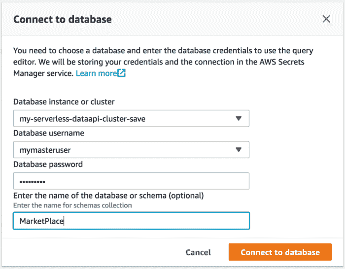

# Amazon Aurora 无服务器数据 API 入门|云专家

> 原文：<https://acloudguru.com/blog/engineering/getting-started-with-the-amazon-aurora-serverless-data-api>

在本文的截屏视频中，我们将介绍使用 Data API 创建 Aurora 无服务器数据库的三种方法。我们还将介绍连接到支持数据 API 的 Aurora 无服务器数据库的四种方法。

让我们快速回顾一下 Amazon Aurora 提供了什么，为什么是无服务器数据库，并回答，什么是数据 API，为什么我应该关心？

## 关于亚马逊极光

Amazon Aurora 是一个为云构建的 MySQL 和 PostgreSQL 兼容的关系数据库[T1，它结合了传统企业数据库的性能和可用性以及开源数据库的简单性和成本效益。](https://aws.amazon.com/relational-database/)

**为什么亚马逊极光没有服务器？** 亚马逊 Aurora 无服务器是为[亚马逊 Aurora](https://aws.amazon.com/rds/aurora/) (MySQL 兼容版)提供的按需、自动扩展配置。数据库将自动启动、关闭，并根据您的应用需求增加或减少容量。对于不频繁、间歇性或不可预测的工作负载，这是一个简单、经济高效的选择。

**什么是亚马逊 Aurora 无服务器数据 API？** Data API 是 Aurora 无服务器数据库之上的新托管 API 层，允许您直接连接 MySQL 或 PostgreSQL 数据库。它还允许您通过 HTTP 从任何应用程序执行 SQL 语句，而无需使用 MySQL 驱动程序、插件或管理连接池或 VPC。

可以将数据 API 看作是与关系数据交互的完全托管的 API。当 Data API 连接到您的无服务器集群时，您还可以继承数据库的自动伸缩、可用性和备份，以及在不使用时暂停数据库。

这是这篇文章的视频版本。尽情享受吧！

* * *

### 使用数据 API 创建 Aurora 无服务器数据库的三种方法:

我个人最喜欢的是选项 2 CloudFormation for deployment，因为您可以部署可预测的资源(与手动创建相比，不会遗漏任何步骤)，并且可以在 CloudFormation 模板中添加额外的 AWS 服务和权限。

**选项#1:亚马逊 RDS 控制台— *手动*** RDS 控制台是一种快速部署资源的方式，按照以下说明只需几分钟即可完成:

**创建新的 Aurora 无服务器集群**:

1.  启动亚马逊 RDS 控制台。
2.  选择**亚马逊极光引擎。**
3.  选择**兼容 MySQL 5.6 的**(无服务器的唯一选项)，然后选择**下一步**。
4.  选择**无服务器**作为容量类型，并提供集群名称和主凭据，然后选择**下一步。**
5.  保留所有默认值，选择**创建数据库。**


Screencast for creating an Aurora Serverless Cluster via the RDS Console

**启用数据 API(针对现有的 Aurora 无服务器集群):** 我们将通过 RDS 管理控制台为新创建的 Aurora 无服务器集群手动启用数据 API。希望这是暂时的，直到我们可以使用 EnableHTTPEndpointAPI 参数通过 CloudFormation 模板启用数据 API。同时…

1.  启动 [RDS 管理控制台](https://console.aws.amazon.com/rds/home?region=us-east-1#databases:)
2.  选择您的集群(即使它显示数据库)
3.  选择右上角的**修改**按钮
4.  选择网络&安全部分下的**数据 API**
5.  选择**继续**按钮
6.  在修改计划下选择**立即应用**
7.  选择“**修改集群**单选按钮

**选项#2:云形成— *自动化*** 云形成是以自动化方式部署一致环境的最佳方式。该解决方案包括基于 GitHub repo [中提供的 CloudFormation 模板创建 CloudFormation 堆栈。](https://github.com/mobilequickie/rds-aurora-mysql-serverless)

该模板包含了为部署 Aurora 无服务器数据库而定义的所有参数，只需点击几下鼠标。除了创建无服务器数据库之外，该模板还创建了一个 AWS Lambda 函数(在 Node.js 8.10 中编写)，以使用新的 [AWS RDSDataService API](https://docs.aws.amazon.com/AWSJavaScriptSDK/latest/AWS/RDSDataService.html) 访问启用了数据 API 的数据库。稍后，当我们在下面的解决方案 3 中连接到一个启用了数据 API 的数据库时，会有更多关于 Lambda 函数的内容。

CloudFormation 模板将提供以下资源:

*   极光无服务器(MySQL) **集群**
*   极光无服务器(MySQL) **数据库**
*   AWS **Lambda 函数**，用于使用 [AWS RDSDataService API](https://docs.aws.amazon.com/AWSJavaScriptSDK/latest/AWS/RDSDataService.html) 通过数据 API 连接到您的数据库。
*   **IAM 策略**用于 RDSDataService API 的 Lambda 执行，CloudWatch 日志，从 AWS Secrets 只读获取数据库主凭证。

**开始使用 CloudFormation** 按照本 [GitHub repo](https://github.com/mobilequickie/rds-aurora-mysql-serverless) 中概述的两(2)个步骤在您的 AWS 帐户中部署资源。

第一步是通过 CloudFormation 堆栈部署资源，第二步是为创建的 Aurora 无服务器数据库启用数据 API。

*   **第一步**:在这里通过 GitHub repo [部署 CloudFormation 栈。](https://github.com/mobilequickie/rds-aurora-mysql-serverless#step-1-create-an-aurora-serverless-database-via-cloudformation)
*   **第二步**:按照 GitHub 第二步指令[启用数据 API 这里](https://github.com/mobilequickie/rds-aurora-mysql-serverless#step-2-enable-data-api-for-your-aurora-serverless-cluster)。

**选项#3: AWS CLI 或 SDK — *脚本化*** AWS CLI 或 AWS SDK 可用于创建您的资源，只需几行代码。下面是创建新的 Aurora 无服务器集群的完整 AWS CLI 语句:

一旦创建了 Aurora 无服务器集群，请按照上一节中的**步骤 2** : *启用数据 API* ，现在您就有了一个启用了数据 API 的 Aurora 无服务器数据库。

* * *

### 使用数据 API 连接到数据库的四种方法

**解决方案#1:数据查询**(通过 RDS 控制台)

1.  启动亚马逊 [RDS 管理控制台](https://console.aws.amazon.com/rds/home?region=us-east-1)。
2.  选择查询编辑器。
3.  在 Connect to Database 窗口中，选择您的集群，提供您的主用户、主口令和数据库名称(可选)。
4.  选择**连接到数据库**。



**注意**:当您第一次提供集群凭证时，服务会自动为您创建一个 AWS 密码，之后每次通过查询编辑器访问该集群时，服务都会使用该 AWS 密码来获取该集群的主用户凭证。

一旦进入查询编辑器，**选择清除按钮**并输入:

```
use MarketPlace;
select * from Customers;
```

选择**运行**。

如果您有一个包含数据的*客户*表，结果如下:


SQL statement in RDS Console — Query Editor

提示:当您需要验证表的内容或者只是执行一些快速的 SQL 语句时，查询编辑器是一个很好的工具。

**解决方案#2: AWS CLI** 使用您自己的集群 arn、机密 arn、数据库名称和您选择的 SQS 选择语句修改提供的 AWS CLI 脚本。

**解决方案#3: AWS Lambda 函数** 一旦您部署了一个启用了 Aurora 无服务器数据 API 的数据库，您就可以使用 RDSDataService API，通过一个简单的 AWS Lambda 函数轻松连接并执行任何 SQL 语句。

这个函数不需要在亚马逊 VPC 中，也不需要任何 MySQL 驱动程序或担心连接池。只需将 SQL 语句作为 HTTP 请求，Aurora Serverless 会处理剩下的事情！

开始使用 Lambda 函数通过数据 API 进行连接:

您可以使用上面的 deploy **选项# 2—**[**cloud formation**](https://github.com/mobilequickie/rds-aurora-mysql-serverless)来提供一个数据库、一个 Lambda 函数，并填写环境变量来开始，或者…您可以**复制这段代码并直接部署到 Lambda**。

如果您手动这样做，您将需要填充 Lambda 环境变量以匹配您的 Aurora 无服务器环境，如集群 Arn、DB name 和 AWS Secrets arn。

下面是针对启用了 Aurora 无服务器数据 API 的数据库执行 SQL 语句的完整代码。同样，确保提供环境变量，然后传入如下内容:

```
{ "sqlStatement": "SELECT * FROM <YOUR-TABLE-NAME>" }
```

Lambda 函数将使用从 AWS Secrets 中提取的主凭证连接到您的数据库，并返回一个 JSON 响应。就这么简单！

**解决方案#4: AWS AppSync** 通过 AWS AppSync 构建 GraphQL API 时，您现在可以直接访问启用了无服务器数据 API 的数据库作为数据源，并且……app sync 将根据现有的数据库表设计为您生成一个 GraphQL 模式！

对于这个解决方案，我们将使用 AWS Amplify CLI 的新的[*add-graphql-data source*](https://aws-amplify.github.io/docs/cli/graphql?sdk=ios#automatically-import-existing-datasources)插件，该插件自动获取您的无服务器数据库表并创建/更新 GraphQL 模式，生成适当的变化、查询和订阅，并将您的数据库设置为现有 GraphQL API 的 graph QL 数据源。是的，请吧。

在我们使用插件之前，我们希望确保我们的 Aurora 无服务器数据库至少有一个表。如果数据库不存在，让我们现在通过使用 RDS 控制台中的 RDS 查询编辑器来创建它们，然后我们将切换到 Amplify CLI+*add-graph QL-data source*插件。

在这里，我们将使用 RDS 查询编辑器来创建一个数据库和示例表。如果您在前面的步骤中已经有了数据库和表格，请转到下面的[放大 CLI —安装 CLI]部分。

*   启动亚马逊 [RDS 管理控制台](https://console.aws.amazon.com/rds/home?region=us-east-1)
*   选择**查询编辑器**
*   在**连接到数据库**窗口中，选择您的集群，提供您的主用户、主密码和数据库名称(可选)。
*   选择**连接数据库。**

在查询编辑器窗口中，运行以下命令:

如果您还没有创建数据库“市场”,请创建它。

```
CREATE DATABASE MarketPlace;
```

创建新的客户表。

```
USE MarketPlace;
CREATE TABLE Customers (
  id int(11) NOT NULL PRIMARY KEY,
  name varchar(50) NOT NULL,
  phone varchar(50) NOT NULL,
  email varchar(50) NOT NULL
);
```

现在我们有了一个数据库和一个 Customers 表，我们现在可以使用 *add-graphql-datasource* 插件来生成一个 graphql 模式，将数据库添加为 datasource，并基于[Customers]表添加变异、查询和订阅。

下面是 *add-graphql-datasource* 插件的工作方式:

**Amplify CLI —安装 CLI** 如果你以前没有安装过 AWS Amplify CLI，这里有一个快捷方式。如果您安装了 AWS CLI，Amplify CLI 将利用这些凭证，因此不需要 *amplify configure* 。

```
$ npm install -g @aws-amplify/cli
$ amplify configure
```

**放大 CLI — Init** 在你的 iOS 项目文件夹的根目录下启动 Mac 终端。现在，我们将使用下面的 Amplify 命令初始化我们的 AWS 后端项目。

```
$ amplify init
```

将指导您完成设置项目的过程。

**放大 CLI —添加 API**

```
$ amplify add api
```

**放大 CLI —添加 GraphQL 数据源**

```
$ amplify api add-graphql-datasource
```

现在，让我们使用 [AppSync 控制台](https://console.aws.amazon.com/appsync/home)中的查询工具在 *Customers* 表中创建一个新客户。


AppSync Queries — in action

然后，我们可以在 [RDS 控制台](https://console.aws.amazon.com/rds/home)的查询编辑器中查询 *Customers* 表，以进行仔细检查。


Amazon RDS Query Editor — Aurora Serverless Data API SQL Statement

现在我们已经有了模式、突变、查询、订阅，以及作为 GraphQL API 数据源的无服务器 Aurora 数据库，我们可以开始使用带有生成代码的移动或 web 客户端来与这些结构化数据进行交互了！

SQL query select 调用可以通过 RDS Data API 返回多少行和数据是有限制的(1000 行或 1MB 的数据)。使用 RDS 数据 API 的另一种方法是使用独立的 MySQL Python 客户端 PyMySQL，它为您提供了建立连接、查询和在 MySQL db(在我们的例子中是无服务器 RDS DB)上获得大量操作的灵活性。尝试我们的动手实验室，使用 Python 和 PyMySQL 集成 Aurora 和 Lambda 函数。

### 结论

Data API 允许任何开发人员通过对数据库的更多控制、更少的管理、没有驱动程序或连接池来利用数据的结构化集合，并且以 HTTP 请求的形式执行 SQL 语句是一个游戏规则改变者。

* * *

## 获得更好职业所需的技能。

掌握现代技术技能，获得认证，提升您的职业生涯。无论您是新手还是经验丰富的专业人士，您都可以通过实践来学习，并在 ACG 的帮助下推进您的云计算职业生涯。

* * *