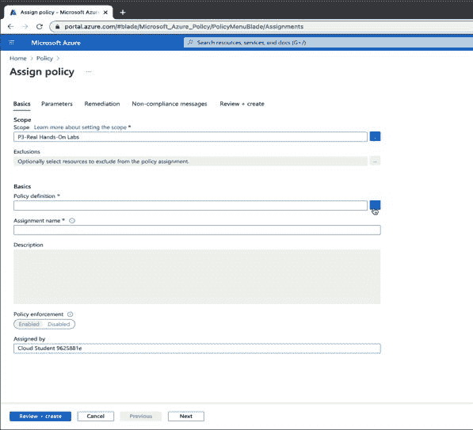

# 如何在 Azure |云专家中快速应用策略

> 原文：<https://acloudguru.com/blog/engineering/how-to-quickly-apply-policies-in-azure>

在本帖中，我们将讨论如何使用 Azure Policy 在 Azure 环境中快速实现治理控制。

## 什么是 Azure 策略？

Azure 策略可帮助您在 Azure 资源上强制实施您组织的合规性要求。这可能有助于:

*   出于安全考虑，限制对特定资源的访问
*   通过限制虚拟机创建来降低成本
*   将数据保存在世界的特定区域

* * *

**通往更好职业的钥匙**

[立即开始 ACG](https://acloudguru.com/pricing) 通过 AWS、Microsoft Azure、Google Cloud 等领域的课程和实际动手实验室来改变你的职业生涯。

* * *

## 使用 Azure 策略内置策略

要在 Azure 中快速应用策略，你需要首先从微软已经提供的内置策略开始。

这里没有必要重新发明轮子。你开始工作所需的大部分政策都已经存在。您可以快速拒绝、记录、更改或部署资源。一旦资源被创建、更新、删除，或者在 Azure 策略的正常评估周期(每 24 小时一次)期间，就会发生这种情况。

首先，在 Azure 的顶部导航菜单中输入“Policy”导航到 Azure Policy。Azure Policy 会自动填充到搜索菜单中，你可以在那里点击“Policy”。

接下来，您将单击左侧导航菜单中“创作”下的“任务”这应该看起来很直观，因为您正在尝试“分配”一个“策略”，所以从技术上来说，这使您成为一个“作者”，因为您有能力创建或创作策略。

从这里开始，您会在顶部看到“分配策略”或“分配方案”

旁注:计划就像策略一样，只是它们帮助您更容易地管理一组具有相同目标的策略。例如，如果您有十几个管理虚拟机合规性的策略，您可以创建一个虚拟机计划并添加、减少和管理计划策略，而不是一次应用一个策略。

出于我们的目的，我们将单击“分配策略”。

您将看到一些需要填写的选项卡和下拉列表。我们只想关注策略定义“下拉框”——我说的“下拉框”是指文本框右侧的省略号或肉丸菜单框。单击此处将打开“可用定义”页面，在这里您将看到所有精彩的内置策略。

要查找您想要开始的策略，您可以在“类型”旁边的搜索菜单中筛选策略

如果您首先键入想要管理的资源(例如，虚拟机)，您将开始看到与该资源相关的所有可用策略。一旦你有了你想要的政策，点击“选择”，你将回到你的基本标签。

在“基本”选项卡上，您可以更改策略的范围，因为它将默认为您的订阅。您可以选择将其更改为更高的范围，如管理组，或者更低的范围，如资源组。您可以暂时保留默认选择。

如果您愿意，可以为您的策略取一个不同的名称，或者保持不变。

最后，写一个很酷的定义，瞧！你已经在 Azure 中快速应用了你的第一个策略。当然，这是在你点击“查看+创建”然后点击“创建”之后

## 了解有关 Azure 治理和合规性的更多信息

如果你觉得这篇文章有帮助，可以看看我的课程，[Azure 上的治理和合规性介绍](https://acloudguru.com/course/introduction-to-governance-and-compliance-on-azure)。

这门入门课程旨在向您概述在您的云环境中有效使用 Azure 原生工具和框架以实现合规性和治理所需的微软最佳实践和方法。它涵盖了 Azure 中用于在 Azure 上实现治理的五种原生工具，并触及了一些常见的治理陷阱。

* * *

*[开始免费试用](https://acloudguru.com/pricing)或查看[本月免费云培训](https://acloudguru.com/blog/news/whats-free-at-acg)。你还可以[在 YouTube 上订阅一位云专家](https://www.youtube.com/c/AcloudGuru/?sub_confirmation=1)的每周云新闻，就像我们在[脸书](https://www.facebook.com/acloudguru)上一样，在[推特](https://twitter.com/acloudguru)上关注我们，并在[不和谐](http://discord.gg/acloudguru)上加入对话。*