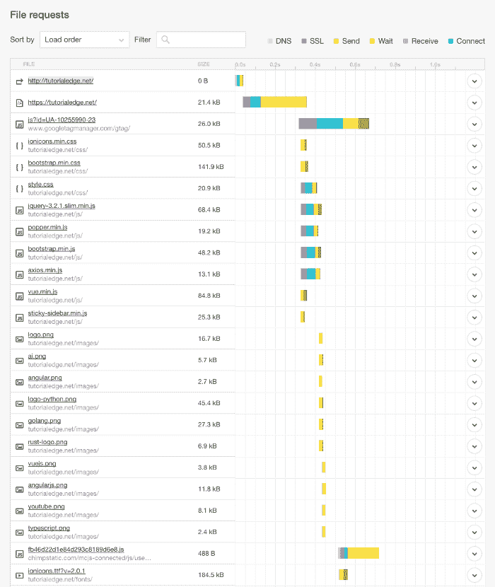

# 我如何在 AWS |云专家上把我的静态网站扩展到全球市场

> 原文：<https://acloudguru.com/blog/engineering/scaling-your-static-site-to-a-global-market-for-a-fraction-of-the-cost-on-aws>

在过去的几年里，我一直在建立一个网站来托管免费编程教程。这个网站始于 2014 年，是一个充满激情的项目，代表了数千小时的鲜血、汗水和泪水——这是我的骄傲和快乐。

现在，我意识到它并不完美——但它是免费的，并为我提供了一个磨练自己技能的机会，同时鼓励其他人学习编程。我的激情项目已经变成了一个成功的、不断成长的副业项目，需要在不花费我一大笔钱的情况下扩大规模。

### 一开始——有一个服务器

该网站起源于 2014 年，当时只是一些反映我兴趣的游戏开发教程。截至 2016 年 1 月，该网站每天的用户总数达到了 150-200 人。

这些年来，这种流量持续增长，对我的服务器的需求也持续增加。额外的流量需要升级我的 Linode 服务器实例——这允许基于 Laravel 的网站继续运行，而不会在短期内崩溃。

在花了很长时间在 Laravel 中构建我的网站，并尝试确定哪些有效之后，我最终迁移到 Hugo——一个不需要 [PHP 或花哨框架](https://acloudguru.com/blog/engineering/serverless-php)的静态网站构建器。

当时，迁移到 Hugo 在一定程度上提高了网站的速度。它还降低了服务器成本，因为我不再依赖 MySQL 数据库来托管内容。我最后还喝了 AWS kool-aid，并把我的站点迁移到了 T2 微实例上。

该站点的架构图如下所示:

有一段时间，一切都很平静。

我的构建管道已经排序。我在写新的内容，并试图改善网站。交通越来越拥挤。那是一个和平的时代。

### **挑战—表演**

过了一会儿，我开始注意到网站开始变慢。网站性能开始明显下降，我隐约知道为什么会这样。

当使用流行的网站速度测试工具 Pingdom 时，在高峰使用时间，我看到在所有其他请求开始解决之前，平均有大约**0.8 秒**的大量等待时间。最终加载时间大约为 1.5-2.5 秒。



注意在这个例子中，在 DNS 解析之后，第二个[请求有很长的等待时间。这些指标是在流量相当少的时期获得的，但是它提供了一些关于性能下降的见解。](https://acloudguru.com/blog/engineering/the-secret-sauce-behind-amazon-route53)

### 计划——考虑我的选择

展望未来，我认为有两种选择:

1.  启动一个负载平衡器和一个自动扩展组，并将我的应用程序部署到所需的任意数量的 T2 实例中。
2.  随着云锋从 T2 迁移到 S3。

第一个选择非常吸引我。我最近一直在学习 Terraform 和创建有弹性的 Go APIs，并且已经将我的站点配置为使用 LetsEncrypt 来处理 HTTPS 流量。

然而，这种选择并不便宜。这种方法意味着成本增加，CPU 容量闲置，需要更多的管理。随着我使用更多的服务和构建更多的教程，我的 AWS 发票每个月都在攀升——所以我担心会给我的账单增加更多的实例。

第二个选择是我认为风险要大得多的。我必须找到一种方法，使用 CloudFront 和 Route53 在前端管理流量，将我的 live 站点从 T2 实例迁移到 S3 的 bucket。

我是所有东西都被加密的忠实拥护者，所以网站继续通过 HTTPS 服务是一个硬性要求。幸运的是，这可以通过使用 Amazon 的 ACM 服务并使用电子邮件验证请求证书来轻松实现。

ACM 现在允许您将 Amazon 发布的 SSL 证书部署到您的弹性负载平衡器或 CloudFront 发行版。查看这篇关于 [AWS 证书管理器](https://acloudguru.com/blog/engineering/aws-certificate-manager-a-potential-game-changer)的帖子。

### 决定—迁移到 S3 的静态站点

迁移我的站点的第一个目的地是 CI/CD 管道。TravisCI 非常简单，如下所示:

```
language: python
install:
  - wget https://github.com/gohugoio/hugo/releases/download/v0.34/hugo_0.34_Linux-64bit.deb
  - sudo dpkg -i hugo*.deb
script:
  - hugo --buildDrafts
  - cp -r scripts public/
deploy:
  provider: s3
  ... all my S3 creds
```

每当有人提交到我的回购主分支，这就启动了一个构建，并上传到我的生产 S3 桶。

一旦 CI/CD 管道就绪，我就完成了一个简单的更改，并确保 bucket 的配置是正确的。

瞧啊。—我要提供的静态文件都在那里，随时可以使用。

在我对我的 CloudFlare 配置和 Route 53 设置的其余部分有信心之后，我将我的站点的名称服务器迁移到 Amazon 的。24 小时后，我准备就绪，并成功完成了迁移。我现在可以退役原来的 T2.micro 实例了。

在配置 CloudFront 发行版时，我选择从所有可能的边缘位置对我的站点进行缓存和服务。

这意味着，每当有人从澳大利亚来请求我的网站时，将首先在边缘位置进行缓存查找——如果缓存命中，网站的加载时间将会非常短。否则，将从原始 S3 存储桶提供服务，并为任何后续请求进行缓存。


The map of all of AWS’ Edge locations

虽然这个选项花费更多，但是性能的提高绝对是值得的，而且总成本仍然远远低于我以前每月的花费。

> 特别感谢艾伦·里德，他帮助我完成了 S3、云锋和 53 号公路的配置

### 结果—更快、更便宜、更好！

迁移到 AWS 静态网站完成后，结果令人震惊。我已经把我的加载时间从大约 1.5 秒-2.5 秒降到了一个**的 234 毫秒**，正如下面的截图所强调的。这是一个疯狂的性能提升。

看看这些请求时间，现在最大比例的时间花在 DNS 解析上，即使这样也不过 0.1 秒多一点。


We are no longer in Wait hell!

根据 Pingdom 的数据，我的网站现在比其他所有测试过的网站快 99%。正如你所看到的，还有一些我可以改进的地方！

但这次迁移最令人震惊的是，它不仅极大地提高了我的站点的性能，还提高了弹性，因为我不再依赖单个 T2 实例来维持我的运行。

从经济角度来看，托管网站的成本已经从大约每月 20 美元降低到大约每月 7 美元:

*   Route53 约为 0.50 美元/月
*   CloudFront 大约是 6.50 美元/月
*   一小部分花费在 S3 桶存储上

这是一个令人难以置信的节省，让我放心。如果有一天我的网站流量激增，我的网站会有弹性，而且不会花我一大笔钱。

### 结论

在尝试了许多部署和托管静态站点的不同方法之后，这无疑是最好的方法之一。

这是性能和成本的完美结合。这种简单性使它成为每个希望托管自己的站点的人的一个容易获得的选择，这些站点具有巨大的弹性和高度的可伸缩性。

* * *

## 获得更好职业所需的技能。

掌握现代技术技能，获得认证，提升您的职业生涯。无论您是新手还是经验丰富的专业人士，您都可以通过实践来学习，并在 ACG 的帮助下推进您的云计算职业生涯。

* * *

大家好！欢迎来到我的频道，TutorialEdge！这是我发布所有视频教程的地方——youtube.com

希望你发现这个激动人心的动荡和胜利的故事很有趣！如果你想支持我，请随时查看我的 YouTube 频道或在 LinkedIn 上加我。