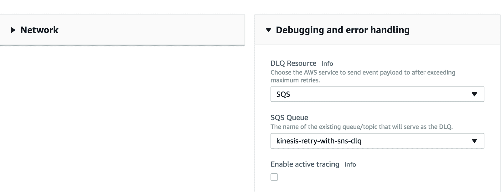

# 使用 Lambda 死信队列重试失败的 Kinesis |云专家

> 原文：<https://acloudguru.com/blog/engineering/use-sns-to-retry-failed-kinesis-events>

在之前的帖子中，我讨论了用 Lambda 处理 Kinesis 事件的[挑战。博客分享了我的一些经验教训和部分失败的技巧，使用死信队列，避免热流。](https://acloudguru.com/blog/engineering/aws-lambda-3-pro-tips-for-working-with-kinesis-streams?utm_source=medium_blog&utm_medium=redirect&utm_campaign=medium_blog)

关于失败的记录，我讨论过，虽然 Lambda 对死信队列的支持扩展到了异步调用，如 *SNS* 和 *S3* ，但它不支持基于轮询的调用，如 *Kinesis* 和 *DynamoDB* 流。这意味着开发者仍然需要为 Kinesis 功能实现重试策略——潜在地利用 SNS 的重试流程。

由于 SNS 已经提供了 DLQ 支持，您可以通过将失败事件发送到 SNS 主题来简化设置。Lambda 会再处理 3 次，然后将其传递给指定的 DLQ。

Treat Kinesis and SNS as different entries points to some business logic that reacts to an event in your domain.

在博客中，我将提供一些具体的例子来说明这是多么容易实现。如果你想自己尝试一下，这篇博客中的例子的代码可以在 [github](https://github.com/theburningmonk/lambda-kinesis-retry-with-sns-demo?opt_id=oeu1606941838236r0.28011037357183466) 获得。

## 运动机能

在我们的运动功能中，我们需要记录我们未能处理的事件。在函数结束时，我们可以将它们发布到 SNS 进行进一步的重试，并利用 SNS 与 Lambda 内置的“重试然后死信队列”流。

正如在上一篇文章中提到的，保持系统实时处理事件通常比确保每个事件都被成功处理更重要，但是你仍然希望在放弃之前给失败的事件一些重试的机会。

作为演示项目的一部分，我还为您提供了一个 API 端点，用于[将事件触发到 Kinesis](https://acloudguru.com/blog/engineering/deep-dive-into-aws-kinesis-at-scale) 。一旦部署完毕，如果您使用查询字符串参数`?fail=true`点击端点，那么您可以观察到 Kinesis 由于一个错误而无法处理记录:

该事件然后将被发布到社交网站。

## 社交网络发布

在 SNS 函数中，我们将提取发布到 Kinesis 的原始事件对象，并尝试使用与 Kinesis 函数相同的业务逻辑再次处理它。

开箱即用，我们得到 3 次尝试，再次用 SNS 事件源处理失败的 Kinesis 事件。

在所有 3 次尝试都用尽之后，还有一次机会用[死信队列(DLQ)支持](http://docs.aws.amazon.com/lambda/latest/dg/dlq.html)保存数据——这仅适用于 SNS 等异步事件源。

从[无服务器](https://serverless.com/framework/)框架的 1.22.0 版本开始，不支持添加 [SQS 作为死信队列资源](https://www.serverless.com/framework/docs/providers/aws/guide/serverless.yml/)(通过`onError`属性)。

还有[无服务器插件-lambda-dead-letter](https://www.npmjs.com/package/serverless-plugin-lambda-dead-letter) 插件，但我从未设法让它工作。因此，与此同时，如果您想使用 SQS，您可能需要手动设置 DLQ 资源。

在我们的 Kinesis 事件被 SNS 处理了 3 次之后，我们可以看到 SNS 事件已经被推送到指定的 SQS 队列…

…with the entire event payload for the SNS function as message.

SNS 消息还有一些额外的消息属性，尽管它们可能对你没用，尤其是我知道的 200 `ErrorCode.`消息，我也被它弄糊涂了！

因此，这是一种简单的方法，可以让 Lambda 借用 SNS 错误处理流来重试几次失败的 Kinesis 事件，同时在带外完成，以允许流继续进行，并保持系统的实时性。

#### **用一致性换取实时性**

使用 Kinesis 的一个主要好处是给定分区键的事件顺序得以保留。例如，对于一个给定的用户 ID，这意味着我们可以按照 Kinesis 接收事件的顺序来处理与该用户相关的事件。我们甚至可以通过在[腐败记录](http://docs.aws.amazon.com/kinesis/latest/APIReference/API_PutRecord.html#API_PutRecord_RequestSyntax)请求中设置`SequenceNumberForOrdering`属性来加强事件的排序。

**我在这里概述的方法牺牲了这种一致性**,因为它将重试推迟到后台进程，因此重试的事件可以相对于同一个分区键的其他事件无序处理。

这是一个有意识的权衡，允许 Kinesis 处理在处理一些事件时持续失败，并保持系统的整体实时性，正如我在以前的帖子中所述:

我们发现保持系统运行比暂停任何失败事件的处理更重要，即使只有一分钟。

需要记住的另一件事是，除非您能够设计出有害消息(当然，这是完全可行的)，否则当持续失败的事件从流中过期时，最终将会为您做出丢弃这些事件的决定。

#### 考虑 SNS 重试对下游系统的影响

正如我在关于发布-订阅和推拉消息模式的文章中所讨论的,[将 Kinesis 与 Lambda](https://acloudguru.com/blog/engineering/auto-scaling-kinesis-streams-with-aws-lambda) 结合使用的另一个好处是，它允许您控制传递给下游系统的负载量。

如果突然出现大量失败事件，通过 SNS 进行的**重试可能会淹没您的下游系统，进而导致更多失败事件**并进一步升级糟糕的情况。

#### 总之——保持真实

由于 Kinesis 的工作方式，并发和重试的级别是在每个分片的级别，这迫使我们在以下两者之间做出选择:

1.  保持整个系统的实时性，并丢弃持续失败的事件
2.  确保所有活动都成功进行

在一个重试直到成功的行为可以被缩小到每个分区键级别的世界里，那么也许我们不需要进行这种权衡。

就目前的情况来看，我认为所有的实时事件处理系统都应该选择选项 1——否则，你就不能真正构建一个“实时”系统。

如果这是你的决定，那么这里概述的方法使你更容易实现重试三次，然后 DLQ 流程，因为它搭载了 Lambda 的 SNS 内置重试行为。

如果您选择选项 2 来确保成功处理所有事件，那么这种方法绝对不适合您！相反，您应该专注于监控和警报，以便快速发现这些有害消息，并将您的系统设计为能够更好地处理它们。

如果，事实证明，你对有害信息的唯一防御是“丢弃它们”——那么你可以首先选择选项 1。

* * *

## 提升您的云计算职业生涯

无论您是云新手还是经验丰富的专家，云专家都能让您轻松(而且非常棒)地获得认证并掌握现代技术技能。查看 ACG 目前的免费课程或立即开始免费试用。

* * *