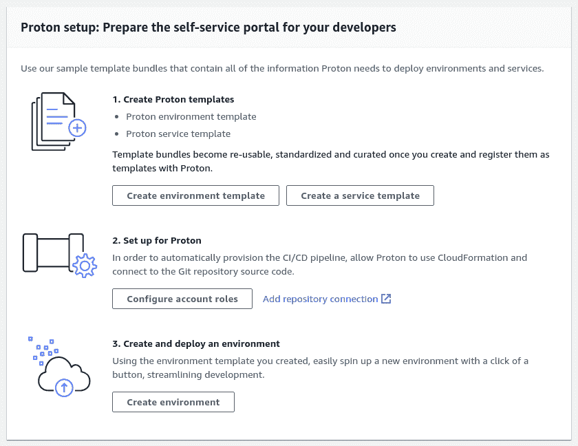

# 关于新的 AWS 质子服务|云专家，你需要知道什么

> 原文：<https://acloudguru.com/blog/engineering/what-you-need-to-know-about-the-new-aws-proton-service>

[AWS Proton](https://aws.amazon.com/proton/) 在 re:Invent 2020 上宣布，是 AWS 的一项全新服务。它是为集中式工程或平台团队设计的，能够为容器化或无服务器应用程序定义部署模板。然后，应用程序团队可以用一组最少的参数来部署这些模板。

AWS 与质子工程师和产品经理一起为我们的沙发系列容器做了拆箱视频。如果你想看实际操作，你可以在这里查看:

质子概念

## Proton 可用于创建基于 AWS 的内部自助服务平台，完全根据您的需求定制。Proton 允许平台工程师为服务和环境创建模板，因此您可以部署和测试您的应用程序。每个服务模板都可以部署到多个**环境**中，以创建易于安全部署的应用程序。

**服务模板**可以包括应用和应用所需的任何附加基础设施，包括 CI/CD 管道。这意味着质子可以完全自动化端到端的应用部署所需的基础设施，如数据库和负载平衡器。

什么样的团队应该采用 AWS Proton？

## 当您的组织足够大，有一个团队可以创建和维护模板时，或者当您有许多可以模板化的应用程序时，最好采用 Proton。如果您有数十或数百个类似的应用程序，经常重复创建基础设施或部署管道，那么 Proton 可以为您的组织节省大量时间，并有助于保持一致和最新的标准。

因为 Proton 可以由一个集中的团队管理，并由多个开发团队使用，所以中央团队能够创建堆栈并代表应用程序团队更新它们。这意味着应用程序团队可以专注于开发他们的应用程序，而集中化的团队可以确保他们的基础架构是最新的，并遵循组织的最佳实践。

Proton 模板包括版本，因此集中的团队很容易准确地看到哪个版本的模板被哪个应用程序和在哪个环境中使用。平台团队可以代表应用团队更新堆栈，以确保一切都符合标准。

应用程序开发人员将能够使用预配置的服务模板和环境来填写必要的信息，从 GitHub 或 Bitbucket 连接他们的代码报告，并以最少的工作量进行部署。

Proton 与其他 AWS 服务相比如何？

## 质子与服务目录

### 你们中的一些人可能熟悉 [AWS 服务目录](https://aws.amazon.com/servicecatalog/)。服务目录允许中央 IT 团队定义经批准的 AWS 服务，您可以在应用程序中部署和使用这些服务。这与 Proton 不同，因为 Proton 可以定义一个完整的服务模板来将完整的应用程序堆栈部署到环境中。

事实上，您可以在您的质子堆栈中使用服务目录提供的产品！如果您有一个在服务目录中创建 Amazon 关系数据库服务(RDS)产品的数据库团队，那么平台团队可以使用这些 RDS 实例作为部署的一个组件提供给应用程序开发人员。

下面是 Proton 和 Service Catalog 之间的主要区别:当 RDS 产品需要更新时，平台团队可以自动为应用程序团队应用它们。在服务目录中，数据库团队不能直接访问已部署的产品。对于服务目录产品更新，数据库团队需要与应用程序团队协调，以确保部署更新。

能够完整地定义一个栈提高了开发人员的生产力，因为平台团队可以准确地定义应该如何部署服务。如果服务模板中定义了 VPC 或可用性区域，则应用程序开发人员无需选择这些选项。

质子对云的形成

## 有些人可能想知道质子和 AWS 云形成之间的区别是什么。虽然两者都可以作为代码用于模板化的基础设施，但用户应该知道 Proton 有几个关键的区别。

第一个区别是:Proton 提供了一个自助式 web 界面，用户可以直接从 AWS 控制台中轻松地发现和部署最新的模板。

第二个是我们之前讨论过的宝腾的所有权模型。部署服务和环境的用户不需要 IAM 许可，因为栈的所有权仍然属于 Proton。这简化了授予用户的权限以及如何处理栈的更新。

第三个区别是，Proton 可以用作通用模板引擎。除了 CloudFormation 之外，还计划添加其他基础设施作为代码模板选项，如 HashiCorp Terraform 和 AWS CDK。

质子 vs 代码星

### 当开发人员使用服务模板时，他们可以为他们的应用程序自动获得 CI/CD 管道。该功能的工作方式类似于 [AWS CodeStar](https://aws.amazon.com/codestar/) 。CodeStar 允许您选择一种应用程序类型，并获得一个自以为是的构建管道，而无需从头开始配置一切。

Proton 还可以根据平台团队创建的服务模板，为您提供自以为是的 CI/CD 渠道。Proton 的好处之一是环境模板允许团队重用管道来将相同的应用程序部署到开发、试运行或生产环境中。

入门指南

## Proton 是免费的，您只需为从部署的模板中提供的 AWS 资源付费。如果你想参与未来的功能和集成，路线图在 [GitHub](https://github.com/aws/aws-proton-public-roadmap/projects/1) 上是公开的。
你可以在 [GitHub 这里](https://github.com/aws-samples/aws-proton-sample-templates)使用其中一个样本模板开始使用 Proton。如果你已经有一个 AWS 帐户，你可以从今天开始在控制台中使用 [AWS Proton！](https://console.aws.amazon.com/proton/home)

Proton is free and you will only pay for the AWS resources provisioned from deployed templates. If you would like to get involved with future features and integrations, the roadmap is public on [GitHub](https://github.com/aws/aws-proton-public-roadmap/projects/1).
You can get started with Proton using one of the sample templates on [GitHub here](https://github.com/aws-samples/aws-proton-sample-templates). If you already have an AWS account, you can start building with [AWS Proton in the console](https://console.aws.amazon.com/proton/home) today!