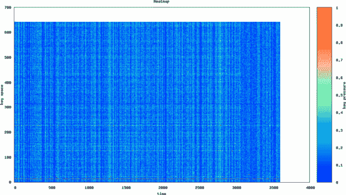
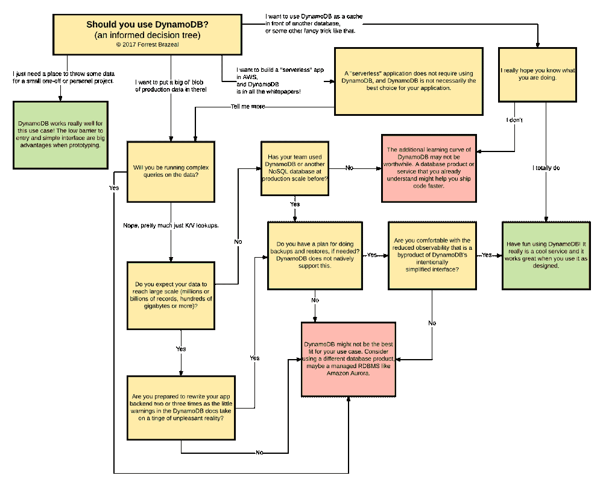

# 为什么 Amazon DynamoDB 不适合所有人|云专家

> 原文：<https://acloudguru.com/blog/engineering/why-amazon-dynamodb-isnt-for-everyone-and-how-to-decide-when-it-s-for-you>

## 如何决定什么时候适合你

*重要提示。自从这篇文章最初发表以来，AWS 已经向 DynamoDB 添加了几个新特性，包括* [*【自适应容量】*](https://www.youtube.com/watch?v=kMY0_m29YzU)*[*按需备份*](https://docs.aws.amazon.com/amazondynamodb/latest/developerguide/BackupRestore.html) *，以及* [*时间点恢复*](https://docs.aws.amazon.com/amazondynamodb/latest/developerguide/PointInTimeRecovery_Howitworks.html) *。虽然本文中的许多观点仍然有效，但有些可能已经过时。在做出任何技术决策之前，请参考最新的 DynamoDB 文档。**

*到 2004 年，亚马逊的业务已经超出了其 Oracle 数据库基础架构的极限。为了扩展不断增长的业务，AWS 设计了一个屡获殊荣的内部键值存储——Amazon Dynamo，以满足他们的性能、可扩展性和可靠性要求。*

*亚马逊发电机现在是 Amazon.com 大部分地区的基础，并定义了一个全新类别的键值存储数据库——“NoSQL”。2012 年，AWS 宣布向客户提供 DynamoDB 作为完全托管的 NoSQL 数据服务，并承诺无缝扩展。*

## *为什么使用 DynamoDB？*

*随着迪纳摩[庆祝其十周年](https://www.allthingsdistributed.com/2017/10/a-decade-of-dynamo.html)，AWS 应该考虑一个名为“ *WhynamoDB* 的配套服务。每当开发人员试图提供新的 DynamoDB 表时，服务就会在 AWS 控制台中弹出，并简单地问:“*为什么？”**

*对“*为什么使用 DynamoDB* ”的回答并不像无缝可伸缩性和[云支持](https://acloudguru.com/platform/accelerator-program)计划的营销承诺那样简单。*

*在过去的几周里，我采访了一些工程师和开发人员，了解他们对 AWS 数据库服务的体验。尽管 DynamoDB 很伟大——尽管它的成功故事令人振奋——但它也留下了大量失败的实现。*

*[DynamoDB |黑客新闻很少有合适的用例——从根本上说，问题似乎是选择一个适合 dynamo db 运行的分区键——news.ycombinator.com](https://news.ycombinator.com/item?id=14721920)*

*为了理解是什么导致一些 [DynamoDB 实现成功](https://acloudguru.com/blog/engineering/using-the-dynamodb-document-client-with-dynamodb-streams-from-aws-lambda)而另一些失败，我们需要检查 DynamoDB 的两大承诺——简单性和可伸缩性之间的本质矛盾。*

## *DynamoDB 很简单——直到它无法扩展*

*我真的不能夸大在 DynamoDB 中开始抛出数据是多么容易。AWS 团队在抽象复杂性方面做得很好——您不必登录管理工作室，不必担心数据库驱动程序，也不必设置集群。*

*要开始使用 DynamoDB，只需转动调配容量旋钮，拿起您最喜欢的 SDK，开始使用 JSON。*

*有了这些特性，难怪 DynamoDB 对“无服务器”应用程序开发人员特别有吸引力。毕竟，许多无服务器应用程序都是从原型开始的，优先考虑交付速度和最小配置。当您甚至不知道您的最终数据模型将会是什么样子时，为什么要搞乱关系数据存储呢？*

## *设计一个基于 DynamoDB 的架构并不容易*

*在这一点上，我们需要做一个关键的区分——没有双关语的意思。DynamoDB 的交互可能很简单，但 DynamoDB 支持的架构设计起来绝对不简单。*

*DynamoDB 是一个键值存储。如果您基于键查找来检索单个记录，它会非常有效。复杂的查询或扫描需要仔细的索引，并且是棘手的或直截了当的，不建议编写——即使你没有非常大量的数据，即使你对 NoSQL 设计原则有所了解。*

*当然，最后一部分是关键所在——与经典的关系数据库设计相比，有很多开发人员不太了解 NoSQL。此外，之前在 NoSQL 的经历并不总是积极的。我和几个工程师谈过，他们的团队在把一堆来自 MongoDB(一个文档数据库)的期望带到 DynamoDB 实现中时，被弄得焦头烂额。*

*因此，当您将缺乏经验的开发人员、缺乏如何在 DynamoDB 中建模数据集的清晰计划，以及使大量非结构化数据的摄取变得非常容易的托管数据库服务结合在一起时，您最终可能会得到一个即使在小范围内也失控的解决方案。*

*Lynn Langit 是一名云数据顾问，在所有三个大型公共云领域都有经验，他已经看够了这些拙劣的实现，有理由对依赖 DynamoDB 等 NoSQL 解决方案的企业保持警惕。*

*当我最近[为“无服务器超级英雄”系列采访 Lynn】时，她分享了一个关于将客户端从 DynamoDB 迁移到 Aurora 的故事——亚马逊](https://read.acloud.guru/serverless-superheroes-lynn-langit-on-big-data-nosql-and-google-versus-aws-f4427dc8679c) [Aurora 无服务器数据 API](https://acloudguru.com/blog/engineering/getting-started-with-the-amazon-aurora-serverless-data-api)——即使他们项目的 AWS 参考架构使用 DynamoDB。*

> *“客户遇到了各种各样的问题，有一天我决定改用 Aurora。吓坏了所有人——他们说，“你在干什么？”我说，‘我们在做什么？我们在运送一种产品。我们做到了。"*

### *DynamoDB 的第一定律:假设 DynamoDB 的实现比使用您已经知道的 rational 数据库更难，而不是更容易。*

*一个关系数据库将在小范围内完成你所需要的大部分事情。与 DynamoDB 相比，它的初始设置可能需要更长的时间，但是 SQL 实现的良好约定可以保护您避免以后浪费大量时间。*

*这并不是因为 DynamoDB 是更糟糕的技术——而是因为它对你来说是新的，如果你不理解它们，那些看起来“简单”和“方便”的东西绝对会咬你一口。*

*哪只 NoSQL DB 是山羊？在 AWS DynamoDB 与 GCP 云数据库和 Bigtable 与 Azure Cosmos DB 的中，看看哪个数据库服务在所有云服务中处于至高无上的地位。*

## *DynamoDB 是可扩展的——直到它变得不简单*

*现在探索另一端——巨大的 DynamoDB 表。在这篇文章中，我采访了一些满意的客户，他们的 DynamoDB 表中有数十亿条记录，延迟达到了亚秒级。DynamoDB 承诺在本质上无限的规模上保持一致的性能，只受 AWS 云的物理大小的限制。*

*毫无例外，这些客户正处于 DynamoDB 规范用例的中心——对分布良好的记录进行键值查找，避免复杂的查询，最重要的是，限制热键。*

*处理热键无疑是 DynamoDB 最著名的“gotcha”。热键的问题在很多地方都有很好的解释，包括 [DynamoDB 开发者指南文档](http://docs.aws.amazon.com/amazondynamodb/latest/developerguide/GuidelinesForTables.html)。*

*[表格的最佳实践——Amazon dynamo db——使用这些表格项目的最佳实践，通过使用——docs.aws.amazon.com](https://docs.aws.amazon.com/amazondynamodb/latest/developerguide/best-practices.html),在降低吞吐量成本的同时获得最佳性能*

*尽管 DynamoDB 可以无限扩展，但您的数据并不是存储在一台神奇的、不断扩展的服务器上。当您的数据增长到超过单个 DynamoDB 碎片或“分区”的容量(高达 10 GB)时，它会被分成块，每个块位于不同的分区上。*

*如果您的数据集中有一个“热”键—一个您经常访问的特定记录—那么您需要确保您的表上的调配容量设置得足够高，以处理所有这些查询。*

*“问题”是您只能在整个表的级别上[提供 DynamoDB 容量，而不是每个分区，并且容量是使用一个相当不可靠的公式在分区之间分配的。因此，您对任何给定记录的读写容量都远远小于您的总体调配容量。](https://docs.aws.amazon.com/amazondynamodb/latest/developerguide/ProvisionedThroughput.html)*

*因此，如果您的应用程序在一个键上使用了太多 rcu，您要么需要过度配置所有其他分区(成本高昂)，生成大量“吞吐量超出”错误(不理想)，要么想办法减少对该键的访问。*

*这里的一个要点是，DynamoDB 不一定适合混合了冷热记录的数据集。但是在足够大的范围内，每个数据集都有这样的混合。当然，您可以将数据拆分到不同的表中——但是如果这样做，您就失去了 DynamoDB 本来应该提供的可伸缩性优势。*

*最近发表了一个关于这个主题的博客，名为“百万美元的工程问题”。它展示了 Segment 如何通过修复与热键相关的 DynamoDB 过度配置来大幅降低其 AWS 账单。那篇文章最有趣的部分是“热图”图形，它准确地显示了哪些分区是麻烦制造者。*

*

A heatmap provided by AWS of the total partitions, along with the key pressure on each* 

*现在，如果你读了小字，这些很酷的图形来自 AWS 的内部工具，而不是来自任何监测部门能够自己做的。换句话说，某个部门的人必须和 DynamoDB 团队通电话，才能观察到他们的数据库问题。*

*即使在那个时候，他们阻止违规键的策略也是将 DynamoDB 调用包装在 try/catch 中——如果特定的键触发了吞吐量异常，则执行自定义跟踪逻辑。*

*实际上，Segment 不得不戴着眼罩来解决热键问题，这就是我们回到简单性和规模之间的紧张关系的地方。*

*DynamoDB 被设计成一个黑盒子，只有很少的用户可访问的控件。这种方法在您刚刚开始时很容易使用。但是在生产规模上——当边缘案例主宰你的生活时——有时你迫切需要更多的洞察力来了解为什么你的数据行为不当。*

*你需要一点同情心的复杂性。*

### *DynamoDB 的第二定律:在大规模上，DynamoDB 的可用性受到其简单性的限制。*

*这不是迪纳摩*架构的问题。*AWS 选择通过 DynamoDB 的*服务曝光什么是个问题。**

*在这一点上，我们甚至还没有触及备份和恢复的问题 DynamoDB 本身并不支持这一点，这在规模上变得非常棘手。无法备份 100TB 的 DynamoDB 数据显然是 Timehop 最近完全停止服务的一个重要原因。*

## *如果不是 DynamoDB，那是什么？*

*因此，如果 DynamoDB 只是小范围内许多看似合理的选择之一，而在大范围内作为一项服务的生存能力有限——它有什么好处呢？*

*如果你问 AWS，几乎任何事情。毕竟——沃纳·威格尔说最初的迪纳摩设计可以处理亚马逊网站 90%的工作量。*

*除了某些特殊情况，如 BI 分析或金融交易，您确实可以重新设计任何应用程序，将业务关系移出数据库，将状态存储在 K/V 表中，并使用事件驱动的架构来满足您的需求。*

*但是正如我的计算机科学教授曾经说过的，“仅仅因为你能，并不意味着你应该。”*

*如果你一开始没有完全理解为什么要使用 DynamoDB，你很可能会像 Ravelin [一样，通过几次代码重写](https://syslog.ravelin.com/scaling-a-startup-using-dynamodb-4d97b0843350)来旋转你的轮子，直到最终找到一个或多或少有效的解决方案——[，但是你仍然有点讨厌。](https://syslog.ravelin.com/you-probably-shouldnt-use-dynamodb-89143c1287ca)*

*你可能不应该使用 DynamoDB——Ravelin syslog 的热心读者会记得去年关于我们使用 dynamo db 的一个故事。它略述了几个——syslog.ravelin.com*

### *DynamoDB 第三定律:商业价值每次都胜过架构理想主义。*

*这就是为什么 Lynn Langit 或多或少地放弃了将 NoSQL 作为中小企业解决方案的原因。这就是为什么 Timehop 从 DynamoDB 转移到 Aurora，也是为什么我采访的另一家知名公司转移到了“一个巨大的 ElasticSearch 集群”。*

*这也是为什么 DynamoDB 有大量来自知名品牌的满意客户的案例研究。这并不是因为这些技术中的一种比另一种更好，而是因为每家公司的工程师，凭借他们特定的使用案例和专业水平，能够用不同的解决方案最快速有效地交付商业价值。*

## ***亚马逊 WhynamoDB***

*在某个时候，亚马逊可能会宣布发布 WhynamoDB 服务，该服务会询问“为什么要提供 DynamoDB 表”。为了准备这次发布，我已经创建了这个方便的决策树来引导你通过 *WhynamoDB* 服务。*

**

* * *

## *获得更好职业所需的技能。*

*[发展云技能](https://acloudguru.com/solutions/individuals)，获得认证，提升您的职业生涯。无论您是刚刚起步还是经验丰富的专业人士，您都可以通过实践来学习，并在 ACG 的帮助下推进您的云计算职业生涯。*

* * *

**如果你喜欢这篇文章，一定要关注我的推特，这里有* [*我是****@****forrestbraceal*](https://twitter.com/forrestbrazeal)*。**